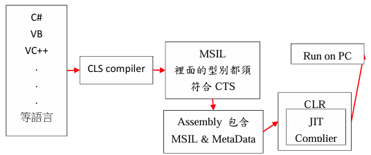

# C# .NET 基本概念 
各種程式語言要整合再一起，最大的難度在於定義與特性，比如說整數型態在 C# 就有16、32 與 64 位元，其他種程式語言可能只支援到 32 位元；又或者是某些程式對於物件導向的支援程度又不一 樣，導致要跨語言的難度大大的提升。 

而 NET 強大的地方在於能夠跨語言，為了要使程式碼能夠在不同的語言中共享，Microsoft 針對此點提出了 CLS (Common Language Specification) 的標準，凡事只要有符合 CLS 標準的規範，彼此就能夠跨語言叫用；因此只要有符合CLS 的語言編譯器，都會把程式編譯成
MSIL (Microsoft InterMediate Language) 中介語言，因為 MSIL 最終還是需要一個
執行環境，再加上 MSIL 本身並不是機器碼，機器看不懂他，所以 MSIL 只是暫時的中介語言，還需要透過一個叫做CLR (Common Language Runtime)，將 MSIL 程式碼轉成機器能夠讀懂的語言。 

在這邊需要注意一點 MSIL 會與 MetaData 包含在 Assembly 中，在經過 CLR 裡的 JIT Compiler 轉成機器碼。 

只要能夠通過 CLS 規範的語言都是 managed 的 .NET 語言 

CTS (Common Type System) 共通型態系統，主要是所有.NET 語言所共通使用的資料型態，這也是跨語言的重要關鍵。