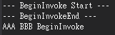

# C# BeginInvoke vs Invoke
當程式在 UI 執行緒上進行比較大量的運算時，會導致畫面卡住，因為要等到運算完成後，畫面才可會繼續執行，但是，這是一個非常不好的設計。背景執行續可以幫助我們將一些較為繁瑣的計算過程，放到背景執行緒中，等執行完成之後再通知我們進行操作。

但是 UI 執行緒與背景跨執行續的過程中，通常會碰到 **BeginInvoke** 與 **Invoke** 兩種跨執行續的方法，往往會搞不清楚到底該呼叫哪一個；為此，本篇主要介紹這兩種調用執行續的方式，避免在使用執行續過程中產生不如預期的結果。

Invoke 與 BeginInvoke 的區別在於：
- Invoke 會阻塞當前的執行續，直到 Invoke 類的委派執行結束，才會繼續執行下去
- BeginInvoke 會非同步的執行，讓主執行續繼續運行

下面將分為幾個情形進行 BeginInvoke 與 Inovke 的詳細探討。

## 1. 主執行緒呼叫 Invoke
在主執行緒 Invoke 呼叫之後，是立即執行 Invoke 裡面的程式碼的，程式碼如下所示：

```csharp
private void UI_Invoke() {
  Console.WriteLine("---Invoke Start---");

  uiThread.Invoke(new Action(() => {
    SpinWait.SpinUntil(() => false, 1000);
    Console.WriteLine("UI Invoke");
  }));

  Console.WriteLine("Print it.");
  Console.WriteLine("---Invoke End---");
}
```
執行結果如下圖 1 所示:


圖 1、主執行緒呼叫 Invoke

可以看到主執行續停在 uiThread.Invoke 等裡面的邏輯做完，才接下去做後面的程式碼。

## 2. 主執行緒呼叫 BeginInvoke
可看到當調用 BeginInvoke 的執行緒結束之後，才會執行 BeginInvoke 裡面的內容，程式碼如下所示：

```csharp
private void UI_BeginInvoke() {
  Console.WriteLine("---BeginInvoke Start---");
  
  uiThread.BeginInvoke(new Action(() => {
    Console.WriteLine("UI BeginInvoke");
  }))
  
  SpinWait.SpinUntil(() => false, 1000);
  Console.WriteLine("Print it.")
  Console.WriteLine("---BeginInvoke End---");
}
```

執行結果如下圖 2 所示:


圖 2、主執行緒呼叫 BeginInvoke

可以看到印出 BeginInvoke Start 字串之後，再來就是先印 Print it. 再來是 BeginInvokeEnd，最後才去執行 BeginInvoke 裡面的輸出。

## 3.主執行緒中先呼叫 BeginInvoke 再呼叫 Invoke
如果在同一個主執行緒中，同時調用 Invoke 與 BeginInvoke 的話，如果 **BeginInvoke 順序是在 Invoke 之前**，那會馬上執行 BeginInvoke，如下程式碼所示：

```csharp
private void UI_BeginInvokeBeforeInvoke() {
  Console.WriteLine("---Start---");
  
  uiThread.BeginInvoke(new Action(() => {
    SpinWait.SpinUntil(() => false, 1000);
    Console.WriteLine("BeginInvoke");
  }));
  
  uiThread.Invoke(new Action(() => {
    SpinWait.SpinUntil(() => false, 500);
    Console.WriteLine("Invoke");
  }));

  Console.WriteLine("---End---");
}
```

執行結果如下圖 3 所示:


圖 3、主執行緒中先呼叫 BeginInvoke 再呼叫 Invoke

在 uiThread.Invoke 之前有 uiThread.BeginInvoke 的話，就會按照順序一個一個輸出。

## 4. 主執行緒中先呼叫 Invoke 在呼叫 BeginInvoke
如果 Invoke 是在 BeginInvoke 之前那就會變成與前面第二段範例一樣，等待呼叫的主執行續執行完成，才會執行 BeginInvoke，如下圖 4 所示：

```csharp
private void UI_BeginInvokeAfterInvoke() {
  Console.WriteLine("---Start---");
  
  uiThread.Invoke(new Action(() => {
    SpinWait.SpinUntil(() => false, 1000);
    Console.WriteLine("Invoke");
  }))

  uiThread.BeginInvoke(new Action(() => {
    SpinWait.SpinUntil(() => false, 500);
    Console.WriteLine("BeginInvoke");
  }))

  Console.WriteLine("---End---");
}
```

執行結果如下圖 4 所示:


圖 4、主執行緒中先呼叫 Invoke 在呼叫 BeginInvoke

## 5. 背景執行緒調用 Invoke
在背景執行緒中調用 Invoke 不只會阻塞主執行緒，也會阻塞背景執行緒，程式碼如下所示：

```csharp
private void UIThreadInvokeInBackgroundThread() {
  Console.WriteLine("--- Invoke Start ---");

  Task.Factory.StartNew(() => {
    string temp = "AAA";
    
    uiThread.Invoke(new Action(() => {
      Console.WriteLine(temp += "Invoke");
    }));
    
    SpinWait.SpinUntil(() => false, 1000);
    
    temp += "BBB";
  });

  Console.WriteLine("--- Invoke End ---");
}
```

結果如下圖 5 所示：


圖 5、背景執行緒中呼叫 UI Invoke

可以看到 Invoke 還會阻塞背景執行緒 (BBB 沒有被加進去)：

## 6. 背景執行緒調用 BeginInvoke
BeginInvoke 在背景執行緒中也會阻塞主執行緒，但是相對於背景執行緒來說是非同步的，因為 BBB 有先顯示出來，程式碼如下所示：
```csharp
private void BackgroundUIThreadBeginInvoke() {
  Console.WriteLine("--- BeginInvoke Start ---");
  
  Task.Factory.StartNew(() => {
    string temp = "AAA";
    
    uiThread.BeginInvoke(new Action(() => {
      Console.WriteLine(temp += "Invoke");
    }));
    
    SpinWait.SpinUntil(() => false, 1000);
    temp += "BBB";
  })
  
  Console.WriteLine("--- BeginInvoke End ---");
}
```



圖 6、背景執行緒中調用 BeginInvoke

## 結論
由上可知由於 Invoke 與 BeginInvoke 是屬於 UI 的執行緒，因此，在執行上會都會阻塞主執行緒，但是 Invoke 的話還會阻塞副執行緒，而 BeginInvoke 來說則不會。

從主執行續執行 BeginInvoke 的話，立即執行裡面的內容，阻塞了主執行緒，而在背景執行續執行 BeginInvoke 的話，則不像 Invoke 在背景執行緒中，當執行到 Invoke 時，因為跑到 UI 執行緒了，卡住後面背景執行緒的操作。

- 使用 Invoke 的情境：需要確保操作，在 UI 執行緒上立即完成並且需要等待其結果時。
- 使用 BeginInvoke 的情境：當你需要在 UI 執行緒上執行操作，但不希望等待其完成，以避免阻塞當前執行緒。