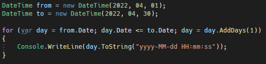
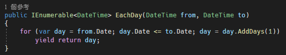
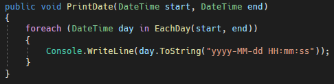

# C# DateTime 迴圈
本篇將介紹如何使用迴圈走訪某段時間區間；將以每日日期走訪的範例，進行說明。

當需要以天作為迭代的次數，可以使用以下方法，如下圖 1 所示：

圖 1、使用 for 迴圈走訪指定的日期範圍

這邊主要的重點是，day = day.AddDays(1)，使用這個方法將日期變數加一天，但是要記住，不能只寫 day.AddDays(1)，因為 day.AddDays 是回傳一個新的實例，並不是將原本的 day 進修改行。

這邊，可將上面的方法，更進一步的寫成 foreach 的形式，程式碼如下圖 2 所示

圖 2、foreach 形式

寫成 foreach 形式後，就能如下圖 3 的方法一樣，使用便利的 foreach
寫法了。

圖 3、調用 foreach loop
