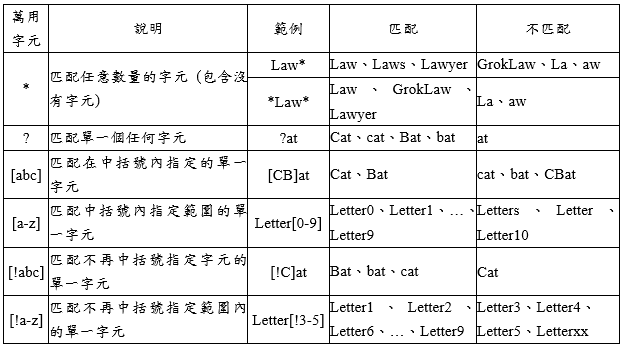

# C# File Globbing

glob 模式主要用在檔案名稱的匹配，通常一般也可以使用 Regex
模式來達到查找檔案名稱或是路徑匹配的目的，不過 glob 使用起來會比 Regex
比較輕量簡單。

glob 模式使用帶有萬用字元的檔案名稱進行匹配。

通常 .gitignore 檔案就是使用 glob 模式來撰寫哪些檔案不進入 git
版本管控中。

Glob 萬用字元範例

如果想要在 C# 裡面也使用 glob 模式來進行檔案的篩選，可以使用
Microsoft.Extension.FileSystem.Globbing 的套件。

不過發現 Microsoft.ExtensionFileSystem.Globbing
對於單一字母的匹配好像不那麼支援，如果有使用到可能要使用 DotNet.Glob
的套件會比較完整。

**參考資料：**

<https://www.goatly.net/post/file-globbing-in-dotnet/>

<https://docs.microsoft.com/en-us/dotnet/core/extensions/file-globbing>

<https://github.com/dazinator/DotNet.Glob>
