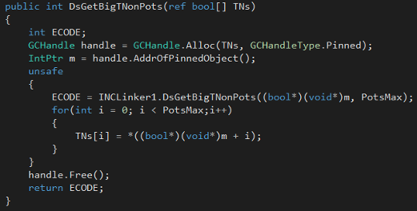
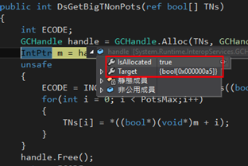
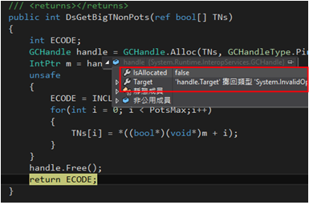

# C# GCHandle 之應用 
## 前言
一般我們所撰寫之 C# 通常都是受到 .NET 所管理的，其實只要能夠透過.NET 編譯器，編譯成共同語言的都是.NET所管理的語言，如C#、C++、VB等，習慣上他們都叫做 C#.NET、C++.NET、VB.NET 等，基本上這些語言在使用上我們不需要去管它的記憶體的分配或是釋放等問題，.NET會有 GC 回收機制，在 CLR 時，就會秘密的幫我們做好這些事情了! 

## 為什麼需要 GCHandle?
.NET 的垃圾回收機制會自動管理記憶體的釋放，但在處理非託管程式碼的時候，GC 可能會在不恰當的時機釋放物件。如果非託管的程式碼還在使用這些已經被釋放的物件，會導致應用程式崩潰。為了避免這種問題的發生，

我們必須先把那個物件用 GCHandle 來 pin (釘)住，讓他的記憶體固定，此時就不會被 GC 回收了，不過在使用完畢後，要記得將此記憶體給釋放掉。 

## 正確使用 GCHandle
下面是使用 GCHandle 的範例，說明要如何在 C# 中安全地處理非託管的呼叫，程式碼如下所示：

程式碼中，在 handle 那邊將上面的名為 TNs 的 bool 陣列給 pin 住，防止記憶體被回收，之後在下方程式碼 handle.AddrOfPinnedObject() 這個方法用來取得物件的穩定的指標。記住在使用完畢記憶體之後一定要自行 Free() 掉，否則記憶體就會越占越多。

## 確認記憶體有被釋放
為了確認物件是不是有被正確的釋放，可以檢查 GCHandle.IsAllocated 屬性。如果物件有被釋放，那麼 IsAllocated 應該要返回 false，代表 GCHandle 沒有釘住任何物件，記憶體有被釋放。

下圖判斷是否有將記憶體free掉的簡單方法。

未被回收掉之前，IsAllocated 會是 true 而且 Target 會是你想要 pin 住的物件。 

記憶體回收掉之後，可以很明顯的看出，IsAllocated 會是 false，而且在 Target 的部分就找不到物件了，這就表示你有將物件釋放掉了，這樣就表示成功了。

## 結論
正確使用 GCHandle 可以避免應用程式免受不可預期的記憶體釋放問題影響，特別是在涉及複雜記憶體操作的高性能應用中尤為重要。