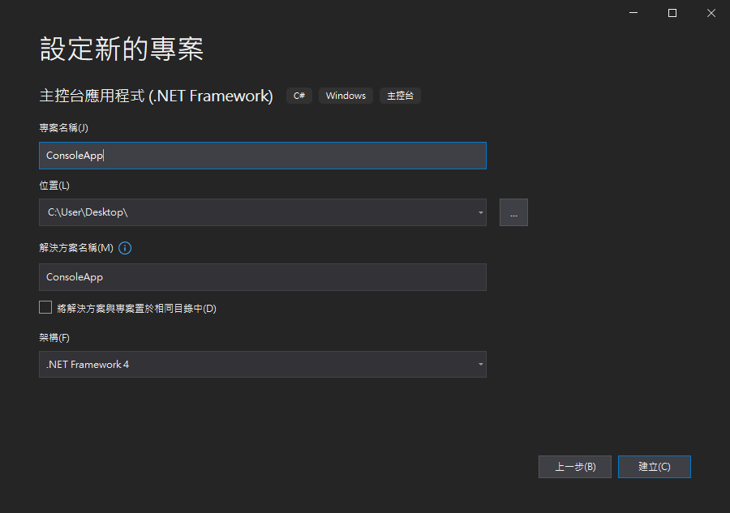
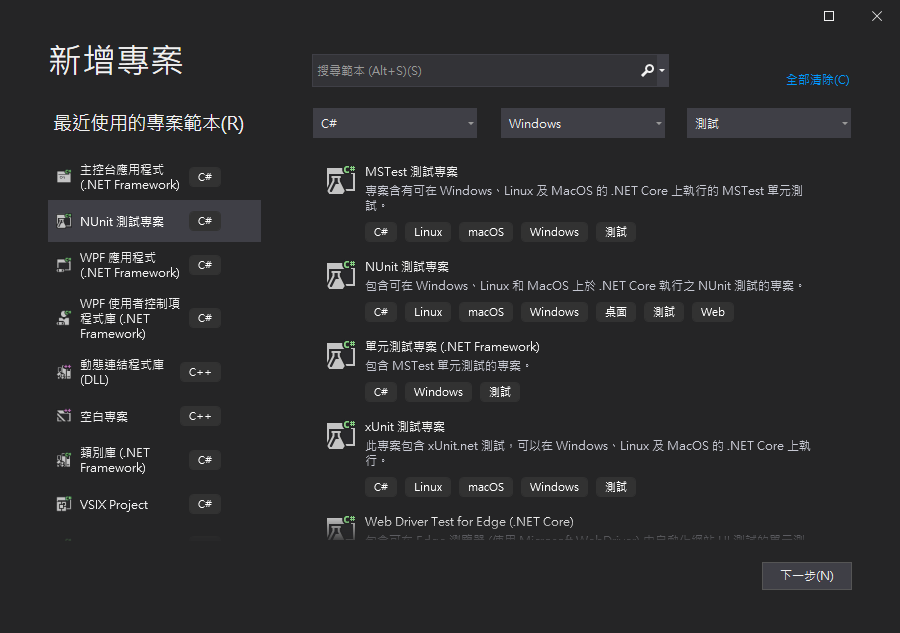
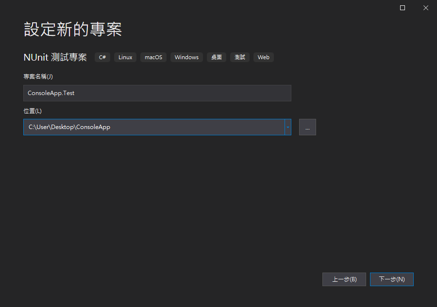
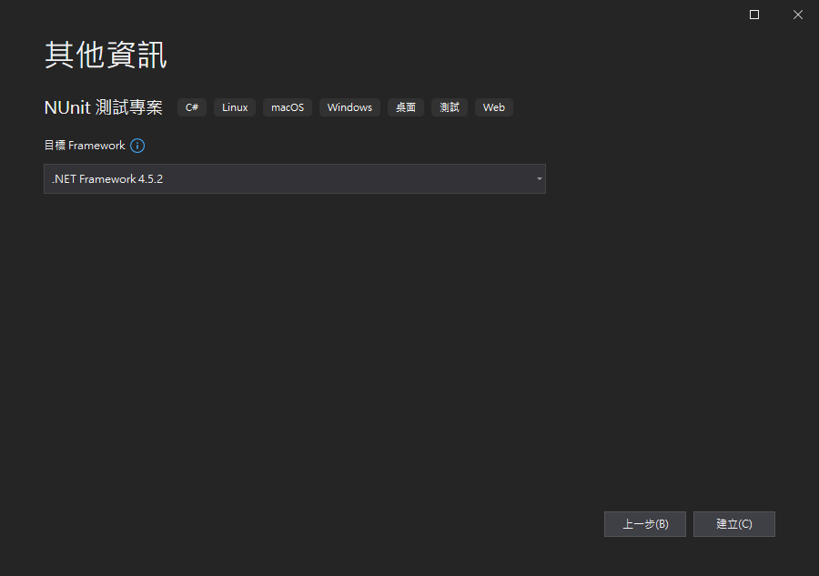
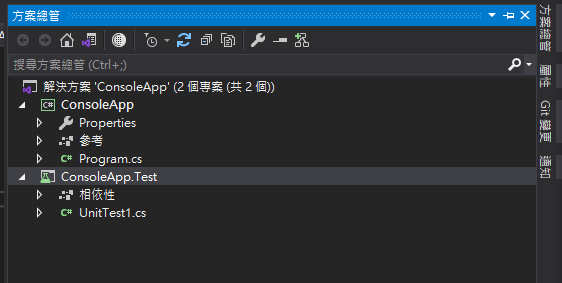
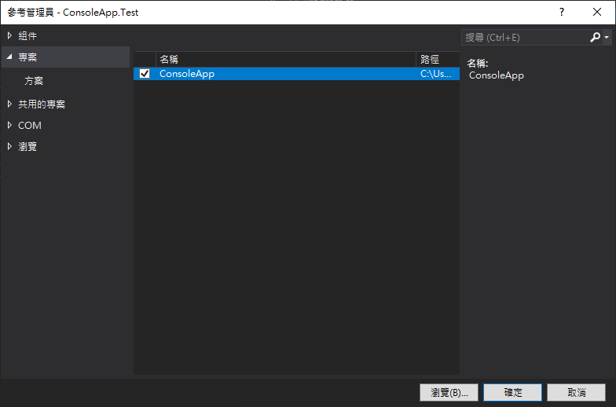
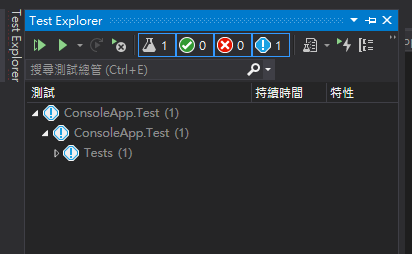

# C# NUnit 單元測試 (1)-測試專案配置
本篇主要介紹要如何在一個解決方案中加入 NUnit 測試專案，對解決方案中的某一個專案進行測試。

> 本篇使用 Visual Studio 2019

假設要測試的專案為 Console 類型的專案，是使用 .NET Framework 4.0 的架構。



接下來，要來新增測試專案，打開方案總管點擊右鍵，新增一個專案，這邊選擇 `NUnit 測試專案`



然後此測試專案的命名習慣為，`待測試的專案名稱.Test`，然後目標架構最好選擇 .NET Framework 4.5.2 以上





建立完成之後，解決方案中可以看到以下畫面



之後在測試專案中，加入待測試專案的參考，選擇 ConsoleApp 專案



建立完成之後，可以開啟 Visual Studio 中的 Test Explorer 可以看到測試的項目



這邊還需要再做一件設定，因為單元測試主要能測試到的為 public 的類別，不過我們在建立 class 的時候，通常預設都為 internal 的，這樣每次都要加 public 比較麻煩，所以這邊再進行一個配置。

開啟待測試專案 (ConsoleApp) 的  AssemblyInfo.cs 檔案 (在 Properties 裡面)，在裡面加上
```cs
[assembly: InternalsVisibleTo("ConsoleApp.Test")]
```

以上即為測試專案的配置