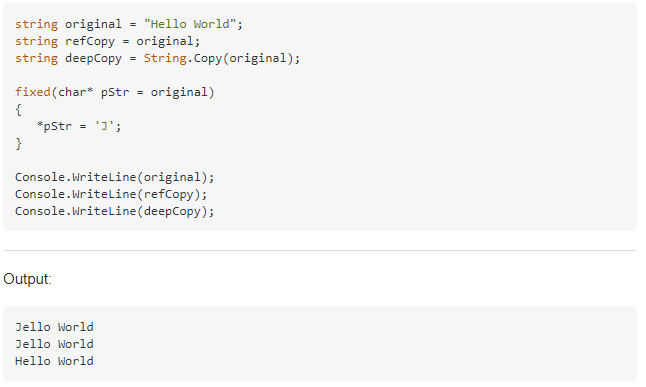

# C# String.Copy

再看之前的人寫的程式碼發現一個困惑的東西，就是為什麼要使用 String.Copy
在進行 string
值的複製，因為一般來說直接使用等號賦值即可；為此，本篇將針對 String.Copy
這個函式進行探討。

微軟上是這麼說的，String.Copy(String) 方法，主要使用與指定的 String
相同的值，建立 String 的新執行個體。也就是說 Copy 方法會回傳與 String
原始字串具有相同的值，但表示不同物件參考的物件。它與指派不同，String.Copy會將現有的字串參考指派給其他的物件變數。

使用這個方法，有一個問題就是明明 string
是不可修改的物件，為什麼不可以直接使用指派的方式就好了，還需要使用一個
String.Copy 的方式進行物件的複製。

查了一下在 Stackoverflow 有查到相關的討論，會使用 String.Copy
主要是可能會使用到 unmanaged 的程式碼，如果沒有使用 String.Copy
的話，會改變參考的值，如下圖 1 所示：

圖1、比較使用 String.Copy 與未使用的差異

**參考文獻：**

https://docs.microsoft.com/zh-tw/dotnet/api/system.string.copy?view=net-5.0

https://stackoverflow.com/questions/520895/whats-the-use-of-system-string-copy-in-net
