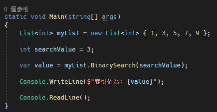
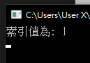
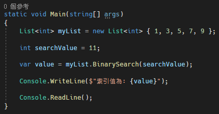
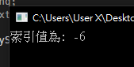
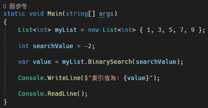
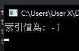
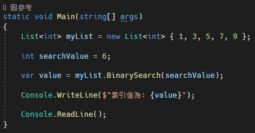
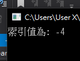
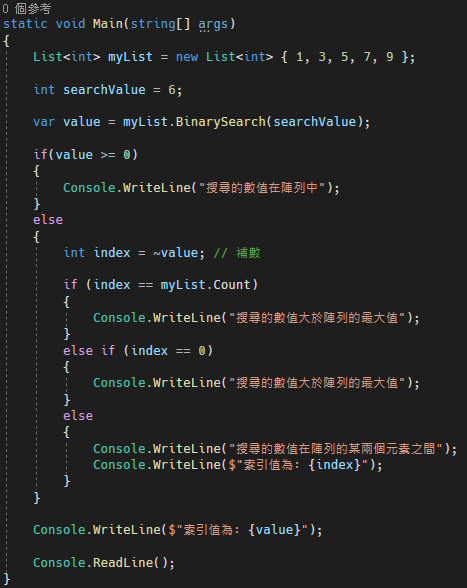

# C# 使用 List 內建的 BinarySearch 方法

目前有一個需求是在一個有排序的數值陣列中，要找到某個值是否在該陣列之中，如果不是陣列內的其中一個元素，那他是大於這個陣列的最大值還是小於這個陣列的最小值抑或是在陣列中某兩個數值之間。

這邊整理一下上面的敘述

1. 在一個有排序的數值陣列中，如果要搜尋的數值有在裡面，就回傳他的索引值

2. 如果不再數值陣列中
    - 指定的數值是大於陣列的最大值
    - 指定的數值是小於陣列的最小值
    - 指定的數值是介於數值陣列中哪邊

原本看到這邊，就在思考是要用什麼方式去把這個功能實作出來，結果發現 C# 原來有已經有提供這個方法的實作了，就是 List\<T\>.BinarySearch 或是 Array.Binary 方法。

他的方式是如果有找到指定的數值，就該數值在陣列中的索引值 (索引值從 0 開始)，如果說找不到數值的話，就會回傳負值，並且這個負值是有意義的。

這邊回傳的負值，這邊的負值是補數的概念

1. 如果負值為 -1，代表指定的數值小於陣列的最小值
2. 如果負值為陣列數量的補數，代表指定的數值大於陣列的最大值
3. 如果負值為第一個大於搜尋數值的項目索引值的補數

> 這邊有一個重點，陣列必須是有排序過的
>
> 接下來針對每個情況進行說明，這邊用串列進行說明
>
> **要搜尋的數值有在串列中**
>
> 要搜尋的數值包含在串列中，程式碼與結果顯示如下圖 1 所示：

圖 1、串列包含搜尋的數值

> **要搜尋的數值，大於串列最大值**
>
> 要搜尋的數值，大於串列最大值，程式碼與結果顯示如下圖 2 所示：

圖 2、搜尋值大於串列最大值

> 得到的索引值是 -6，可以發現是串列大小 5 的補數
>
> **要搜尋的數值，小於串列最小值**
>
> 要搜尋的數值，小於串列最小值，程式碼與結果顯示如下圖 3 所示：
>
> 

> 

圖 3、搜尋值小於串列最小值

> 可以發現回傳的數值是 0 的補數
>
> **要搜尋的數值不再串列中，但在串列數值的範圍內**
>
> 要搜尋的數值不再串列中，但在串列數值的範圍內，程式碼與結果顯示如下圖 4
> 所示：
>
> ex. 要搜尋的數值是 6，不在串列元素內，但在串列元素 5 與 7 之間

圖 4、搜尋值在串列的數值範圍內

> 回傳了元素 7 索引值 3 的補數 -4
>
> 這樣我們就能夠使用上面的邏輯完成我們所要的功能了，程式碼如下圖 5
> 所示：
>
> 
>
> 圖 5、邏輯實現
