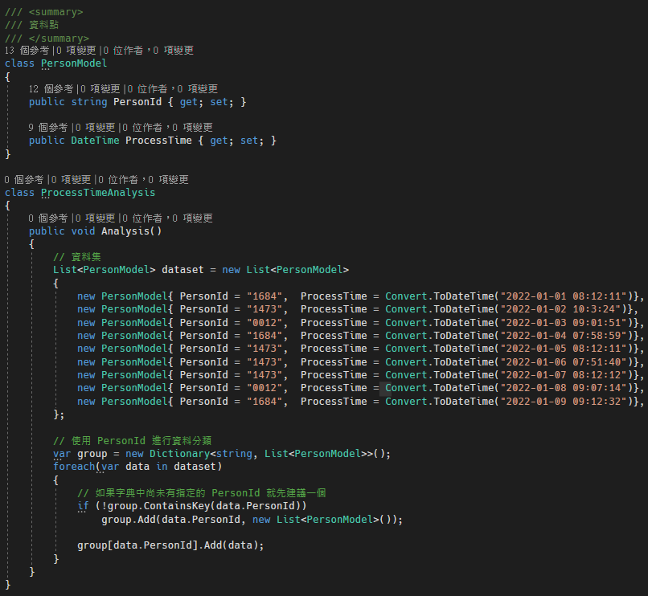
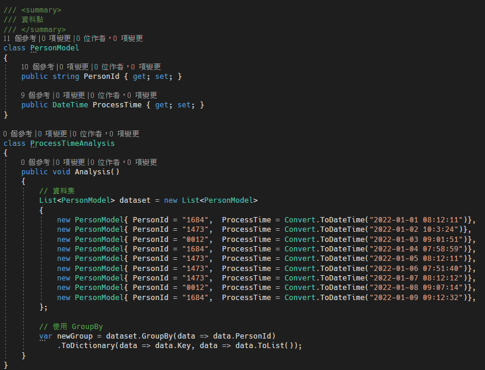

# C# 使用Linq GroupBy 進行資料及分組

最近碰到需要對一個資料集，根據特定的屬性目標來對資料做分組的需求。Linq 有提供好用的 GroupBy 方法，可對資料集進行分組的功能。

之前在碰到這類問題的時候，第一直覺都是使用 Dictionary\<string, List\<T\>\> 的方法，使用迴圈的方式來將指定的屬性值，放到指定的字典中，如下程式碼所示：

圖 1、使用迴圈加入到字典中

上面的做法是對資料集進行迴圈，判斷指定的屬性 (PersonId)
是否在字典中有鍵值，沒有的話，先建立一個存放資料集的串列，並將資料點加入到該串列中，以此來進行資料的分組。

GroupBy 功能方法如下，使用 GroupBy
時指定元素的屬性或是欄位，他就會以這個屬性作分組處理，如下圖 2 所示。

圖 2、使用 GroupBy

使用 GroupBy 搭配 ToDictionary 的方法，即可快速的進行分類。
