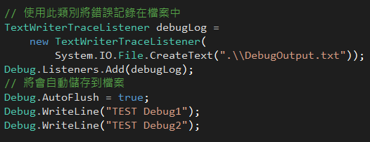
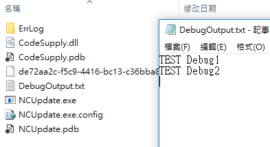
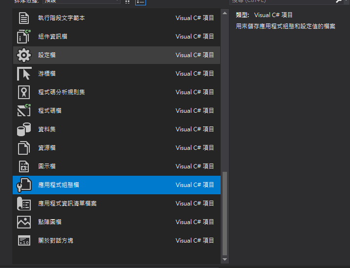
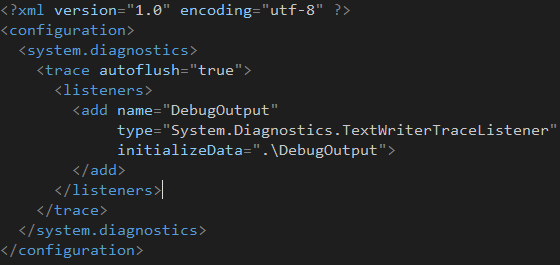
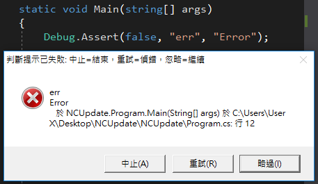

# C# 好用的除錯工具

一般我們在使用 try...catch 擋下來的錯誤都是使用 MessageBox.Show(...)
將錯誤訊息顯示出來，可是軟體要發行時，就還要很麻煩的一一的去註解掉，真的是很不方便，而且當中有些錯誤訊息又是可遇不可求的時候，一不小心關閉了錯誤視窗，想要嘗試在找出來又要經過一番的測試才有辦法得到，因此本篇要介紹一個好用的除錯紀錄工具
**Debug.Listener**。

使用此方法可以將錯誤訊息以 txt
檔的方式，記錄在預設的路徑下面，當想查看程式錯誤時，有一個記錄檔可以慢慢欣賞錯誤訊息。除錯紀錄方式基本上有兩個方法可以實現，首先第一個方法是在打在程式碼中實現。

可以在你預設的路徑下找到你剛剛命名的檔案，點開裡面就會記錄錯誤訊息了。

第二種方法使用應用程式組態檔的方式，將錯誤紀錄，

新增了應用程式組態檔後，在下面輸入以下程式碼，裡面就會記錄所有Debug輸出的訊息啦，而且也不會像第一個方法一樣每次都會蓋掉之前的輸出訊息。

有了紀錄工具後，C#
還有一個Debug.Assert()的方法，這就是本篇的重點了，當有錯誤的時候習慣用
try...catch 先將錯誤擋下，並使用錯誤訊息使用MessageBox.Show()
顯示並不是很好的方法，就像上面說的，程式發行的時候還要一一的去把MessageBox的地方註解掉，現在有了此方法，既可以除錯，又不用擔心專案發行時要去把它註解掉，使用以下方法。

Debug.Assert(false, "err"，"Error");

使用Debug.Assert()
方法最主要是在觀察條件是否有成立，若沒有成立就跳出警告視窗，條件沒有成立可能是自己所沒有想到的條件，所以少用
try catch 來忽略錯誤，否則未來很難找出錯誤的地方
