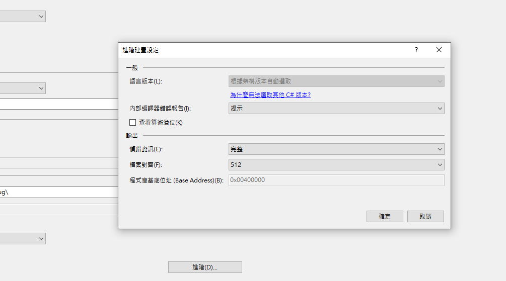
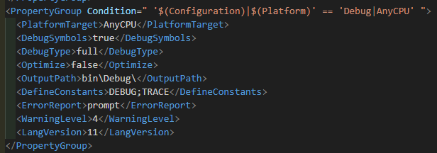
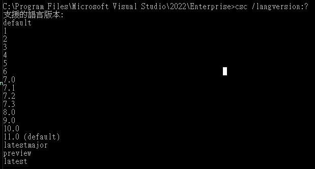

# 如何使用 C# 最新語言版本

平常我比較常開發 .NET Framework Runtime 是
4.0，在這個架構下，我能使用到的語法是 C#
7.3，如果想要去屬性裡面修改其他語言版本是沒有辦法的，如下圖 1 所示：

對專案點擊右鍵 屬性 建置 進階

圖 1、語言版本無法修改

雖然選項中無法修改，但是我們還是能透過手動添加標籤的方式，改變專案使用的
C# 語言版本，打開專案的 csproj 檔案，新增
\<LangVersion\>11\</LangVersion\>，如下圖 2 所示

圖2、新增LangVersion 標籤

**加入完成之後，將專案重新載入，就能開始用最新語言版本提供的語法了!**

如果想要知道目前的Visual Studio 編輯器，可以使用到 C#
第幾版的語言，可以開啟 Developer Command Prompt，開啟之後，輸入 **csc
/langversion:?**，就可以看到該編輯器所有的語言版本了，如下圖 3 所示：

圖 3、編輯器支援語言版本查詢

**參考連結：**

<https://learn.microsoft.com/zh-tw/dotnet/csharp/whats-new/csharp-11#raw-string-literals>

<https://learn.microsoft.com/zh-tw/dotnet/csharp/language-reference/configure-language-version>
