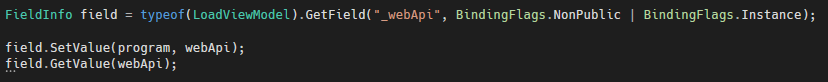
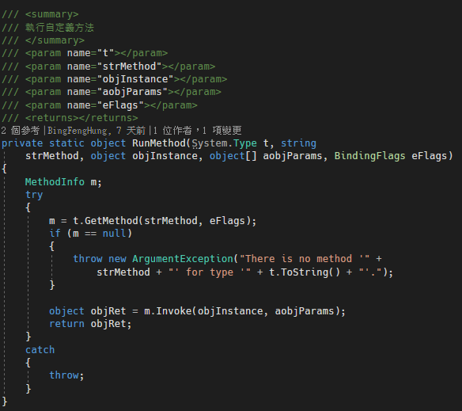
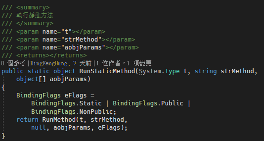
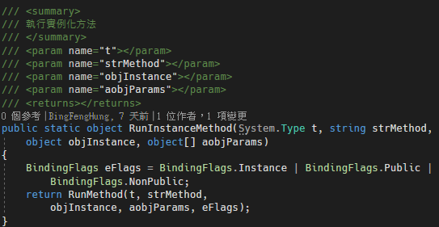

# C# 存取其他類別中的私有欄位

在進行單元測試的時候，可以透過在 A 專案中的 AssemblyInfo.cs 的檔案中，加入 \[assembly: InternalsVisibleTo("B專案")\]
的屬性，讓指定的B 專案，可以存取到 A 專案的 interal
修飾詞的類別、屬性、方法或是欄位。

但是，在進行測試的時候，有時候想要測試的值或是觀察的值是屬於私有欄位，導致無法測試到，此時，可以使用以下簡單的方法，透過反射的方式來存取到其他類別的私有欄位，程式碼如下圖
1 所示：

圖1、私有方法存取

使用 FieldInfo 類別，先取得指定類別的類型，在使用 GetField
指定要存取的欄位名稱，接下來就可以透過 FieldInfo 類別的 SetValue 與
GetValue 方法，來對指令欄位進行存取。

另外，以下提供執行靜態方法、私有方法的函式：

圖1、執行方法定義

靜態方法呼叫，程式碼如下圖 3 所示：

圖3、靜態方法呼叫

實例化私有方法呼叫，程式碼如下圖 4 所示：

圖 4、私有方法呼叫

使用上述提供的方式，可以讓程式碼的測試覆蓋性更佳。
