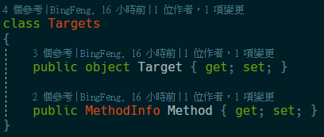
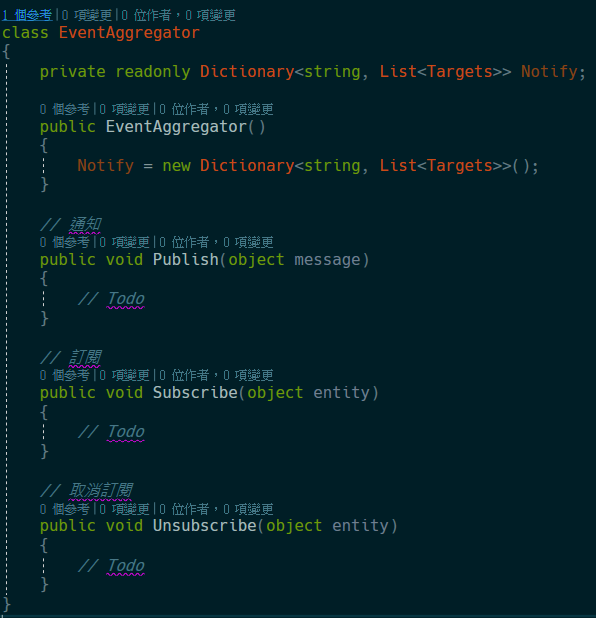
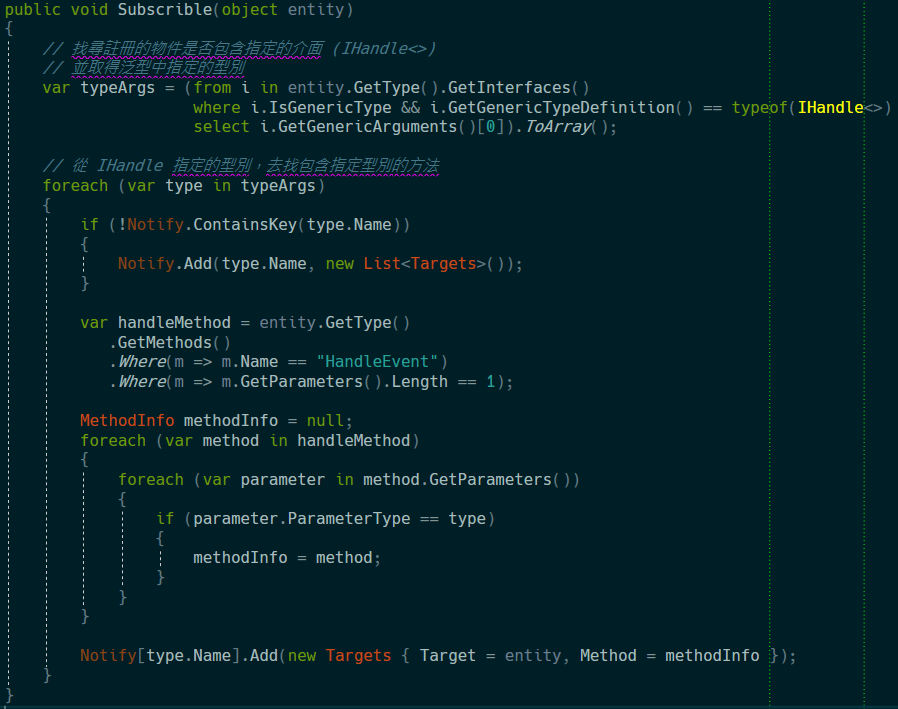
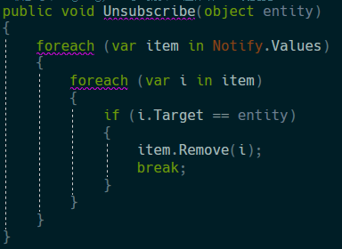
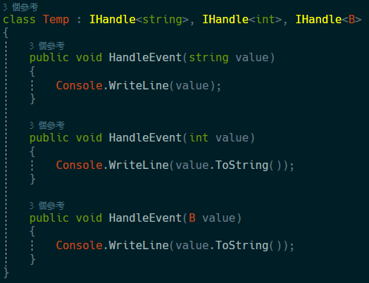
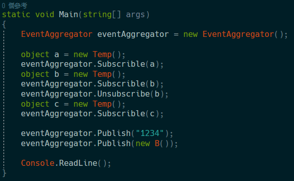
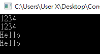

# C# 實作EventAggregator 實現兩物件之間的溝通

兩物件之間的溝通，通常實作的方式為，類別 A 先公開想給別人註冊的委派或是事件，再由類別 B 進行註冊的動作，因此當類別 A 有事件發生時，向所有與類別 A 有進行註冊的類別發出事件，讓有註冊的類別接續處理其自身的事件。上面的事件註冊的寫法本身沒什麼問題，主要的問題是，如果我有很多不同型別的事件要註冊，那我在類別 A 的地方就必須公開很多委派，讓外部類別可以註冊；為此，本篇將介紹 EventAggregator 的類別方法，透過介面加上反射的應用，來減少須公開很多委派的情況。

首先 EventAggregator 的使用主要是，欲註冊的類別透過繼承指定介面的方式，再向 EventAggregator 註冊，在進行註冊時，EventAggregator 類別會去判定是否有實作指定的介面，如果有實作介面時，才允許類別向 EventAggregator 註冊，之後當有任一類別發出通知時，就會去檢查 EventAggregator 的註冊列表，向列表裡面的事件進行通知。

首先實作方法簽章的介面，這個介面主要是讓 EventAggregator 後面可以去裡面的方法，每個欲註冊的類別必須實作此介面；此介面的參數型別為泛型，每次進行通知時，將以此泛型的型別來做為發布給誰的依據，介面如下圖 1 所示：

圖1、方法介面

製作一個類別，其主要放置註冊的物件以及方法 (MethodInfo)，如下圖2所示：

圖2、註冊資料暫存類別

之後就製作 EventAggregators 的類別，建立一個 Dictionary 主要放置 Key 為指定的型別以及 List\<Targets\> 為註冊列表，註冊的型別會當作 Dictionary 的 Key 值，List\<Targets\>
則放置，註冊的物件以及欲註冊的方法，如下圖3所示：

圖3、註冊列表

實作類別，方法包含，訂閱、取消訂閱與通知三個方法，完整類別結構如下圖4所示：

圖4、類別結構

實作訂閱方法，如下圖5所示：

圖5、訂閱方法實作

首先根據傳入的物件，找尋是否有實作 IHandle
介面，並找尋此介面中的指定型別，找到型別之後，使用型別的 Name 如
(type.Name) 當作註冊列表的 key 值，之後透過物件找尋指定的方法名稱
HandleEvent ，此方法名稱只可包含一個參數，最後要找尋此物件指定方法的
MethodInfo，進行參數類型的比較，如果相同就暫存 MethodInfo
，然後將傳入的物件與 MethodInfo 加入到字典中，就完成註冊的功能了。

取消註冊的功能，此功能找尋註冊列表中是否含有指定的物件，如果找到了就將所有的事件進行註銷的動作，如下圖6：

圖6、取消註冊

最後是通知的部分，首先找到 message 參數的 type ，透過此 type 的 Name
找到方法列表，然後就進行方法的呼叫，呼叫方法如下圖7：

圖7、通知實作

以上即為所有 EventAggregator 的實作了。

實際應用：Temp 類別繼承 IHandle 介面，並有有不同的型別，string, int
以及自訂型別 B，實作其各自的 HandleEvent，範例如下圖8、9：

圖8、實際應用

圖9、類別註冊與通知

先將EventAggregator
的類別實例化，然後透過此物件進行註冊的動作，最後在進行
Publish(指定型別)，結果如下圖10：

圖10、呼叫結果
