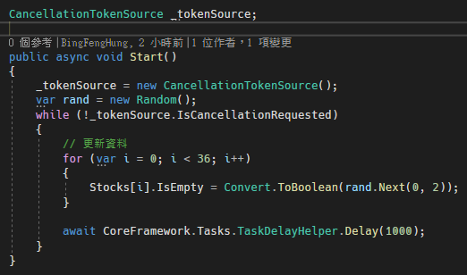
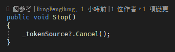
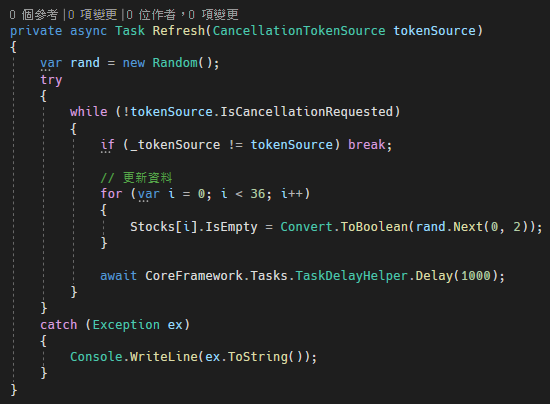

# C# 讓 CancellationTokenSource 正確停止

通常需要大量運算的事情我們會將寫執行續讓其在背後處理，如何正確地將執行續停止是很重要的一件事情，為此，本篇將介紹如何正確使用
CancellationTokenSource 的方法。

先來看錯誤的寫法，一般會有 Start 與 Stop
兩個方法，來啟動與暫停執行續，Start 方法程式碼如下圖 1 所示：

圖 1、Start 方法中啟動執行續

\_tokenSource 是一個全域變數，每當呼叫 Start 方法時，就去建立一個新的
CancellationTokenSource的實例給 \_tokenSource全域變數，並可以看到在
while 迴圈的地方使用此全域變數判斷是否有呼叫 IsCancellationRequested，
如果有則跳出迴圈。

下面是 Stop 方法，用來對 \_tokenSource 這個全域變數下 Cancel
的指令，程式如下圖 2 所示：

圖 2、Stop 方法

上面的方法看似沒有問題，但是如果在 Start 與 Stop
方法之間快速的切換，會導致執行續並沒有正確關閉的問題，同時有多支執行續在執行。

為什麼會有這個問題呢?因為 Start 裡面有一個等待 1 秒鐘的指令，在這 1
秒鐘的指令裡面，從新建立了新的 \_tokenSource
的實體，導致記憶體變了，然後等待 1 秒鐘的指令完成時，再次執行到 while
迴圈的判斷，但是 \_tokenSource
已經是新的記憶體了，這個新的記憶體並沒有取消的指令，導致迴圈繼續執行，這就導致記憶體洩漏。

為了解決此問題，正確的方式是，將 Start
裡面刷新的那段程式碼，另外方到一個方法中，並且將 \_tokenSource
作為參數傳入該方法中，這樣做的好處是，傳入的參數變成是區域變數，程式碼如下圖
3 所示：

所以在下停止指令時，由於 while 迴圈中的 tokenSource
的記憶體是與終止的記憶體是同一個並未變更，這樣就能夠正常的判斷到有下終止的指令。
