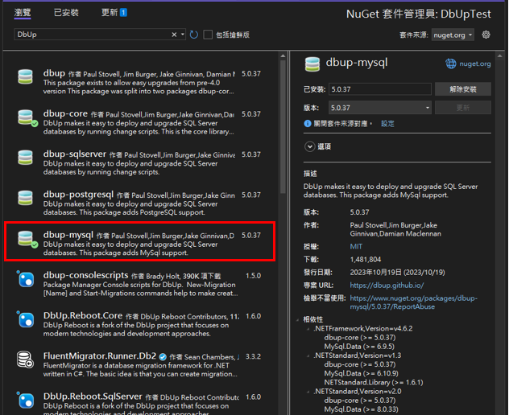
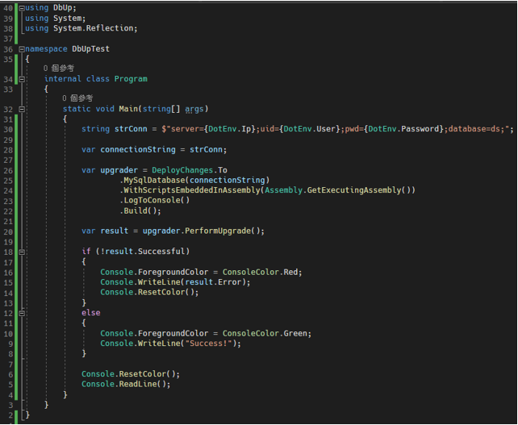
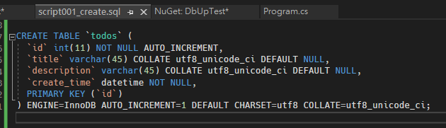
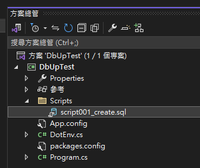
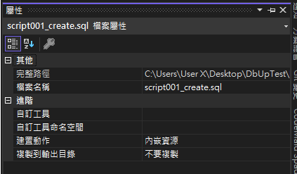
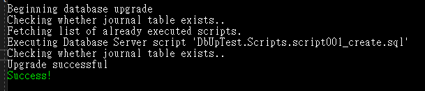

# C# 資料庫遷移工具 DbUp
### 前言
在介紹工具之前，要先說明資料庫遷移 (Migration) 是什麼，通常在操作資料庫的時候，常見作法是透過 MySQL Workbench 這個 GUI 工具，直接在上面建立與修改資料表，這樣操作很方便，但是有一個問題是，這些操作並沒有操作紀錄，如果有另外一台也要建立相同的資料表，有可能剛幫他新增好了，但是原本的資料表又做了修改，就要在另外一台也做相同的操作，在這一來一往的過程中，就有可能發生少資料的問題。

要讓我們的操作步驟有跡可循，就要使用到資料庫遷移的方式，一個簡單的概念是，每一次更改資料表的操作，就是一筆 Migration 的紀錄，因為有這些紀錄，讓我們能夠對資料庫也進行版本管控，這樣在拿到另外一台機器的時候，透過這個紀錄可以很方便的更新。

### 下載 DbUp 套件
在 C# 中有很多資料庫遷移的工具，目前使用 DbUp 這個輕量工具，接下來將介紹如何使用這項工具，因為他目前最新的套件版本 (2023/10/19) 支援的平台是 .NET Framework 4.6.2 以上的版本，所以建議直接建立比這個更高的 .NET Framework 的 Console 專案出來。

專案建立完成後，再來就使用 Nuget 下載 dbup-mysql 套件，畫面如下圖 1 所示：


圖 1、安裝 dbup-mysql

### 如何使用
安裝完成之後，先來寫我們的程式碼，下面的程式碼跟官方的範例是一樣的只是改成我們資料庫的連線字串，程式如下圖 2 所示：


圖 2、專案程式碼

再來就能建立我們的 SQL 語法腳本了，如下圖 3 所示：


圖 3、SQL 語法

把資料庫腳本都放到 Scripts 資料夾中，如下圖 4 所示：


圖 4、統一腳本資料夾

腳本這邊要將他先設定為內嵌資源，如下圖 5 所示：


圖 5、將 sql 腳本設定為內嵌資源

再來就能夠執行程式碼了，畫面如下圖 6 所示：


圖 6、成功執行

可以看他就順利幫我們新增資料表了。

```
小技巧：
如果你想要重新整個重來，但是發現他好像都沒有幫你更新，去找到 schemaversions 那張表，把裡面內容清空，他就會當作執行過的腳本是全新的了。
```

### 參考連結：
[https://github.com/DbUp/DbUp](https://github.com/DbUp/DbUp)
[https://dbup.readthedocs.io/en/latest/](https://dbup.readthedocs.io/en/latest/)
[https://jimmyswebnote.com/postgresql-migration-database-migration/](https://jimmyswebnote.com/postgresql-migration-database-migration/)
