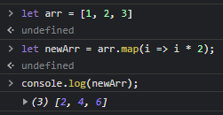
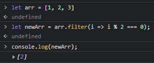
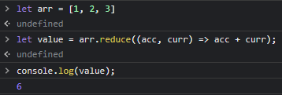

# C# 陣列操作方法如同 JavaScript 一樣 (map、filter 與 reduce)
## 前言
JavaScript、Python 等語言中，map、filter 與 reduce 是操作陣列常用的方式，幫助我們在操作一些陣列時，可以不使用迴圈，並且具有很容易閱讀的特性，如果想要在 C# 中也達到相同的操作也是可以的，本篇將針對這幾個操作方法做說明。

> 這邊先用 JavaScript 來針對這幾項操作方法作範例

1. map 特色
  - 透過函式內所傳入的值，經作操作之後組合成新的陣列 
  - 不會改變原本陣列的值 
  - 新的陣列長度會等於原始陣列的長度
  - 如果沒有回傳則是 undefined

> 

<hr>

2. filter 特色 
  - 透過指定函數篩選之後，將通過驗證的元素回傳到新的陣列中
  - 不會改變原本陣列的元素

> 

<hr>

3. reduce 特色 
  - 讓陣列中的每個元素與回傳的值再次做運算 
  - 將陣列化為單一的值

> 

C# 中的 Linq，也能夠讓我們達到這些方法，像是有繼承 IEnumerable 介面的類別 (例如，List、HashSet) 等都有等價的方法

**1. Map =\> Select 方法**

**2. Filter =\> Where 方法**

**3. Reduce =\> Aggregate 方法**

程式碼如下所述：
```cs
using System;
using System.Linq;
using System.Collections.Generic;

namespace Test { 
  class SuperClass { 
    public SuperClass(int vlaue) {
      this.Value = value;
    }

    public int Value { get;set; } 
  }
  
  class ClassA : SuperClass {
    public ClassA(int value) : base(value) {}
  }
  
  static class Test {
    static void Main() {
      var data = new List<SuperClass>() { 
        new SuperClass(0),
        new SuperClass(1),
        new SuperClass(2),
      }
      
      // Select 結果顯示為 
      // { 元素 0、元素 1、元素 2 }，型別為 List<ClassA>
      List<ClassA> list1 = data.Select(e => e as ClassA).ToList();
      
      // Where，結果顯示為
      // { 元素 1、元素 2 }，型別為 List<ClassA>
      List<ClassA> list2 = data.Where(e => e.Value > 0).ToList();

      // Aggregate，顯示結果為
      // 3，型別為 int
      int sum = list2.Aggregate(0, (acc, cur) => acc += cur.Value);
    }
  }
}
```

