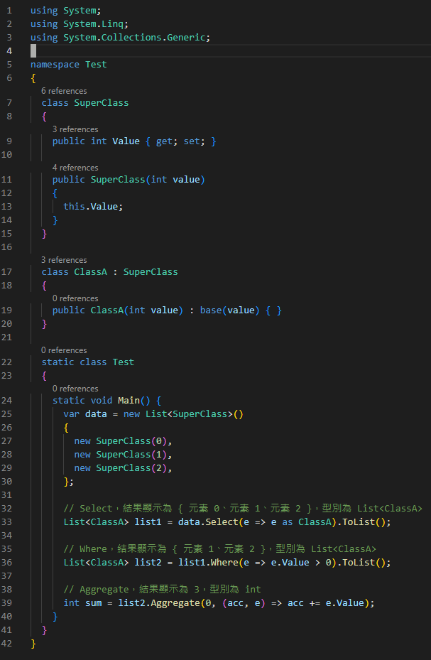

# C# 陣列操作方法如同 JavaScript 一樣 (map、filter 與 reduce)

JavaScript、Python 等語言中，map、filter 與 reduce
是操作陣列常用的方式，幫助我們在操作一些陣列時，可以不使用迴圈，並且具有很容易閱讀的特性，如果想要在
C# 中也達到相同的操作也是可以的，本篇將針對這幾個操作方法做說明。

> 這邊先用 JavaScript 來針對這幾項操作方法作範例

1.  map 特色

    -   透過函式內所傳入的值，經作操作之後組合成新的陣列

    -   不會改變原本陣列的值

    -   新的陣列長度會等於原始陣列的長度

    -   如果沒有回傳則是 undefined

> 

2.  filter 特色

    -   透過指定函數篩選之後，將通過驗證的元素回傳到新的陣列中

    -   不會改變原本陣列的元素

> 

3.  reduce 特色

    -   讓陣列中的每個元素與回傳的值再次做運算

    -   將陣列化為單一的值

> 

C# 中的 Linq，也能夠讓我們達到這些方法，像是有繼承 IEnumerable
介面的類別 (例如，List、HashSet) 等都有等價的方法

**1. Map =\> Select 方法**

**2. Filter =\> Where 方法**

**3. Reduce =\> Aggregate 方法**

程式碼如下所述：

