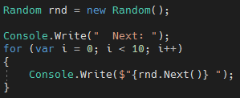
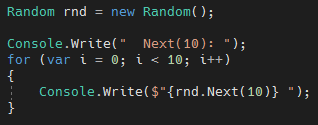
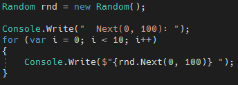
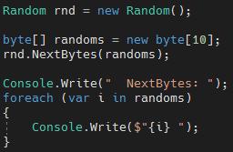
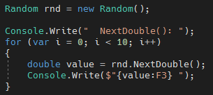
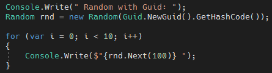
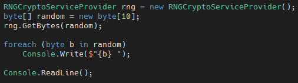

# C# 隨機數值產生

本篇將介紹如何產生隨機的數值，其中最常使用到的以下三種方法：

1.  使用 Random 類別
2.  使用 Guid 類別
3.  使用 RNGCryptoServiceProvider 類別

### 1. 使用 Random 類別

MSDN 定義為：表示虛擬亂數產生器，此演算法可產生特定隨機統計需求的數字序列

一般預設如果使用 Random 的話會使用當前時間作為亂數種子，產生亂數序列或是建構子給定一個 int32 大小的數值，使用指定的種子值作為起始值，初始化 Random 類別的新執行個體。並且搭配 Next 的方法取得亂數序列的值

取得亂數值，共有 Next、NextBytes 與 NextDouble 等方法

**Next()** 回傳 32 位元的整數大於 0 並且小於 int 的 MaxValue，如下圖 1 所示：

圖 1、Next()

**Next(Int32)** 回傳小於指定之最大值的非負值隨機變數，如下圖 2 所示：

圖 2、Next(Int32)

**Next(Int32, Int32)** 回傳指定範圍內的隨機變數，如下圖 3 所示：

圖 3、Next(Int32, Int32)

**NextBytes(Byte\[\])** 以亂數填入指定位元組陣列的數值，如下圖4所示：

圖 4、NextBytes(Byte\[\])

※ 亂數值會是 byte 的大小 (0\~254)

**NextDouble()** 回傳大於或等於 0.0 且小於 1.0 的隨機浮點數，如下圖 5
所示：

圖 5、NextDouble()

2.  **使用 Guid 類別**

Guid 表示全域唯一識別項 (GUID)

是指在一台機器上生成的數字，他保證在同一時空中所有機器都是唯一的。

GUID 使用電腦的網卡編號 + CPU 編號+時間+亂數產生的。這種識別項被複製的可能性非常低。

圖 6、使用 Guid 搭配 Random

※使用此方法可以避免單純使用 Random
亂數種子產生重複的問題，會較具有隨機性

3.  **使用** **RNGCryptoServiceProvider 類別**

使用由密碼編譯服務供應者 (CSP) 提供的實作
(implementation)，實作密碼編譯亂數產生器 (RNG)。

圖 7、使用 RNGCryptoServiceProvider
