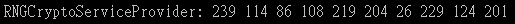

# C# 隨機數值產生
## 前言
本篇將介紹如何產生隨機的數值，其中最常使用以下三種方法：

1. Random 類別
2. Guid 類別
3. RNGCryptoServiceProvider 類別

## 1. Random 類別
> MSDN 定義為：表示虛擬亂數產生器，此演算法可產生特定隨機統計需求的數字序列

一般預設如果使用 Random 的話會使用當前時間作為亂數種子，產生亂數序列或是建構子給定一個 int32 大小的數值，使用指定的種子值作為起始值，初始化 Random 類別的新執行個體。並且搭配 Next 的方法取得亂數序列的值

取得亂數值，共有 Next、NextBytes 與 NextDouble 等方法

**Next()** 回傳 32 位元的整數大於 0 並且小於 int 的 MaxValue，程式碼如下所示：

```cs
Random rnd = new Random();

Console.Write(" Next: ");

for (var i = 0; i < 10; i++) {
  Console.Write($"{rnd.Next()} ");
}
```

**執行結果：**


<hr>

**Next(Int32)** 回傳小於指定之最大值的非負值隨機變數，如下程式碼所示：

```cs
Random rnd = new Random();

Console.Write(" Next(10): ");

for (var i = 0; i < 10; i++) {
  Console.Write($"{rnd.Next(10)} ");
}
```

**執行結果：**

<hr>

**Next(Int32, Int32)** 回傳指定範圍內的隨機變數，如下程式碼所示：
```cs
Random rnd = new Random();

Console.Write(" Next(0, 100): ");

for (var i = 0; i < 10; i++) {
  Console.Write($"{rnd.Next(100)} ");
}
```

**執行結果：**


<hr>

**NextBytes(Byte\[\])** 以亂數填入指定位元組陣列的數值，如程式碼所示：

```cs
Random rnd = new Random();

byte[] randoms = new byte[10];
rnd.NextBytes(randoms);

Console.Write(" NextBytes: ");

foreach(var i in randoms) {
  Console.Write($"{i} ");
}
```

**執行結果：**


※ 亂數值會是 byte 的大小 (0\~254)

<hr>

**NextDouble()** 回傳大於或等於 0.0 且小於 1.0 的隨機浮點數，如下程式碼所示：

```cs
Random rnd = new Random();

Console.Write(" NextDouble(): ");

for (var i = 0; i < 10; i++) {
  double value = rnd.NextDouble();
  Console.Write($"{value:F3} ");
}
```

**執行結果：**


## 2. 使用 Guid 類別
Guid 表示全域唯一識別項 (GUID)

是指在一台機器上生成的數字，他保證在同一時空中所有機器都是唯一的。

GUID 使用電腦的網卡編號 + CPU 編號+時間+亂數產生的。這種識別項被複製的可能性非常低，程式碼如下所示：

```cs
Console.Write(" Random with GUID: ");

Random rnd = new Random(Guid.NewGuid().GetHashCode());

for (var i = 0; i < 10; i++) {
  Console.Write($"{rnd.Next(100)} ");
}
```

**執行結果：**


※使用此方法可以避免單純使用 Random 亂數種子產生重複的問題，會較具有隨機性

## 3.使用 RNGCryptoServiceProvider 類別
使用由密碼編譯服務供應者 (CSP) 提供的實作 (implementation)，實作密碼編譯亂數產生器 (RNG)，程式碼如下所示：

```cs
RNGCryptoServiceProvider rng = new RNGCryptoServiceProvider();
byte[] random = new byte[10];
rng.GetBytes(random);

foreach(byte b in random) {
  Console.Write($"{b} ");
}

Console.ReadLine();
```

**執行結果：**



