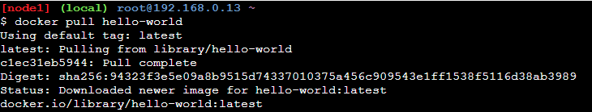
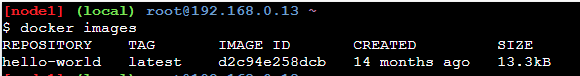
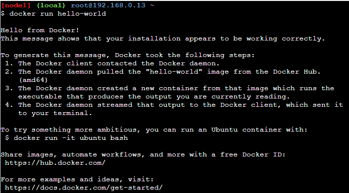

# Docker 基本概念 (2)

## 前言
前一篇介紹到了 Docker 關鍵的兩個東西：映像檔與容器。為此，本篇將詳細介紹這兩個名詞。

## Docker 映像檔
Docker Images 就是容器的藍圖，本身並不具有執行的能力 (Readonly)，只是用來儲存以下的項目：
- 執行環境
- 應用程式 Source Code
- 應用程式的相關依賴
- 其他的配置 (如，環境變數)
- 一些指令

Images 有自己的檔案系統，與本機中其他的程序是獨立開來的。

上面提到唯讀 (Readonly)，也就是說在建立 Images 之後，就無法再做修改了，如果真的有需要修改 Images 的話，就只能再重新建立新的 Images 了。

## 如何從 DockerHub 下載映像檔
DockerHub 是 Docker 官方的儲存庫，可以在上面找到自己需要的映像檔，並且將其拉下來使用，指令如下：

```bash
docker pull hello-world
```



等它下載完成之後，可以透過 docker images 查看是否有成功拉取 hello-world 這個映像檔下來。

```bash
docker images
```



## Docker 容器
容器是 Images 的可執行實例，因此，透過建立 images 作為容器的藍圖，當 Docker 執行 Images 它會建立一個容器，其為一個程序，可以根據在 Images 裡面的描述執行裡面的應用程式。

**容器同樣被認為是獨立的程序，意味著他們是一個獨立於其他程序的程序。**

由於容器裏面包含了執行應用程式所需的所有東西，所以在其他電腦上面，並不需要額外進行環境的安裝與配置，因為這些東西都在容器裡面了。

也就是說，開發人員可以將拿著這個 Image 到任何有 Docker 的電腦上面，然後透過 Docker 將這個 Image 跑起來就可以了，它跑起來的狀況混與我們在開發時的狀況是一模一樣的。

## 如何執行容器
要跑一個容器起來，需要使用 docker run 的指令，指令如下：

```bash
docker run hello-world
```

如果容器有順利執行，可以看到 Hello from Docker! 的一大堆字串



## 系列文章
[Docker 基本概念 (1)-Docker 是甚麼](https://bingfenghung.github.io/blog/)

[Docker 基本概念 (2)-映像檔與容器](https://bingfenghung.github.io/blog/)