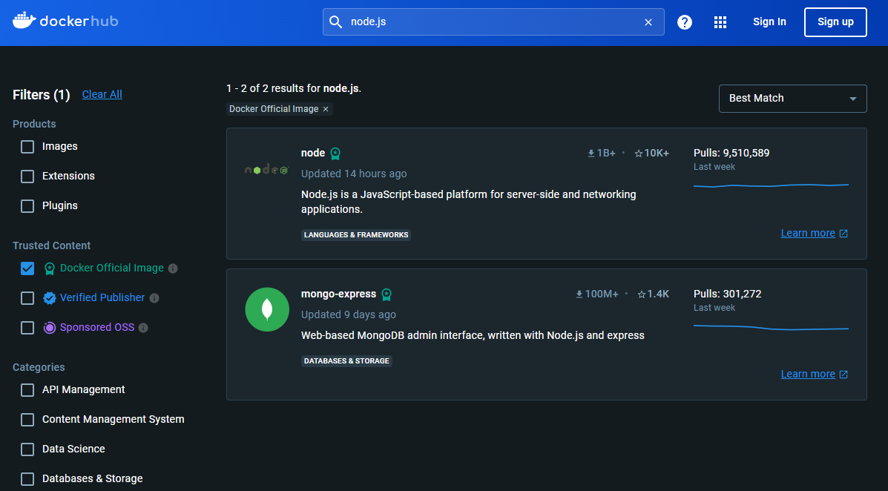
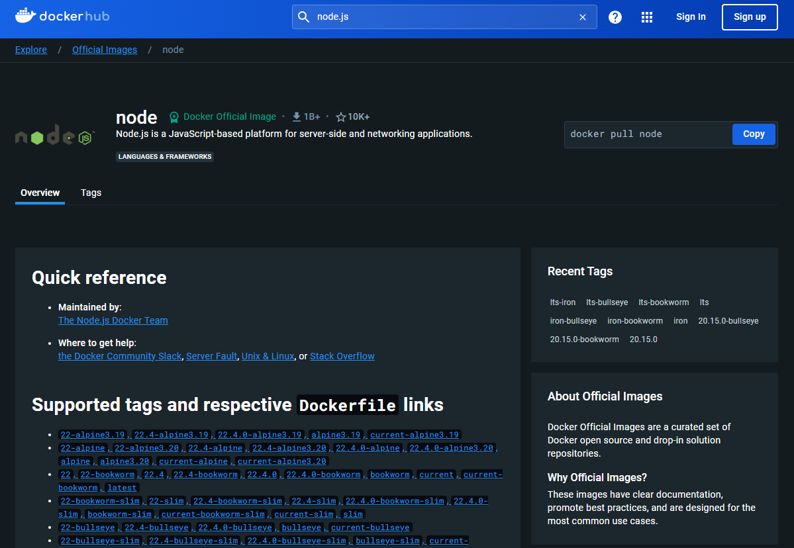
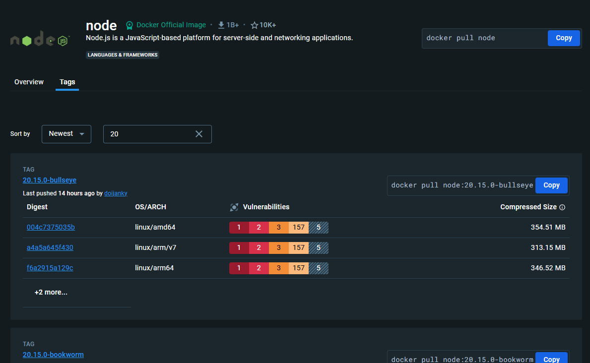
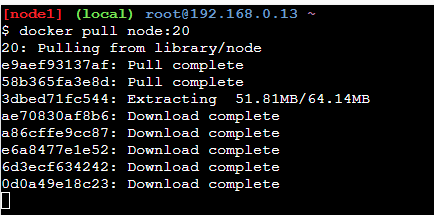
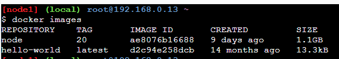

# Docker 基本概念 (3)

## 前言
前一篇介紹到了 Docker 的映像檔與容器的詳細說明，並說明如何使用，本篇將在更進一步對父映像檔做說明。

## 父映像檔 (Parent Image)
Image 是由好幾層所堆疊起來的，每一層基本上就是向 Image 上面加東西，所以每一層的順序很重要。

因此，最一開始的那一層是叫父映像檔 (Parent Image)，**這一層包含了容器所需要的作業系統與執行環境**。例如，Parent Image 包含了一個輕量的作業系統以及一個執行環境 (node.js)。

然後在 Parent Image 之上建立的下一層可以是任何的東西。例如，複製 Source Code 到 Image 中，安裝相依套件或是任何需要執行的腳本之類的。

要取得 Parent Image 很簡單，就是向 Docker Hub 拉取一個需要的 Image 作為第一層使用即可。

## Docker Hub 下載父映像檔
通常會去 Docker Hub 上面看對應的執行環境，因為這樣作業系統與執行環境都有，就比較不用再額外去安裝執行環境了。

像是假設我需要 Node.js 20 版本的映像檔，直接到 Docker Hub 上面進行搜尋，如下圖所示：



點選第一個 Node.js 的官方 Image，畫面如下圖所示：



因為我們要下載 Node.js 20 版本的映像檔，可以點選旁邊的 Tags 然後直接在裡面搜尋 20，如下圖所示：



## 下載指定的 node.js 映像檔版本
接下來我們就要拉取指定版本的 node.js 映像檔，指令如下：

```bash
docker pull node:20
```

它就會開始進行下載的動作了，如下圖所示：



再用 docker images 查看是否有下載成功



可以看到上圖多了 node TAG 20 的 Image。

## 相關連結
[Play with Docker](https://labs.play-with-docker.com/)

[Docker 官方教學文件](https://docs.docker.com/guides/workshop/)

[Docker Hub](https://hub.docker.com/)


## 系列文章
[Docker 基本概念 (1)-Docker 是甚麼](https://bingfenghung.github.io/blog/articles/Docker%3C_%3E%3EDocker%20%E5%9F%BA%E6%9C%AC%E6%A6%82%E5%BF%B5%20(1))

[Docker 基本概念 (2)-映像檔與容器](https://bingfenghung.github.io/blog/articles/Docker%3C_%3E%3EDocker%20%E5%9F%BA%E6%9C%AC%E6%A6%82%E5%BF%B5%20(2))

[Docker 基本概念 (3)-父映像檔](https://bingfenghung.github.io/blog/articles/Docker%3C_%3E%3EDocker%20%E5%9F%BA%E6%9C%AC%E6%A6%82%E5%BF%B5%20(3))

[Docker 基本概念 (4)-使用 Dockerfile 建立映像檔](https://bingfenghung.github.io/blog/articles/Docker%3C_%3E%3EDocker%20%E5%9F%BA%E6%9C%AC%E6%A6%82%E5%BF%B5%20(4))

[Docker 基本概念 (5)-Docker 常用指令](https://bingfenghung.github.io/blog/articles/Docker%3C_%3E%3EDocker%20%E5%9F%BA%E6%9C%AC%E6%A6%82%E5%BF%B5%20(5))