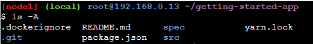
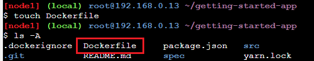
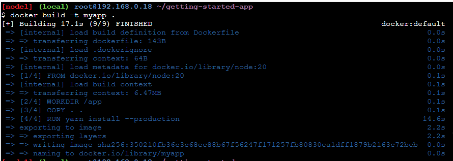
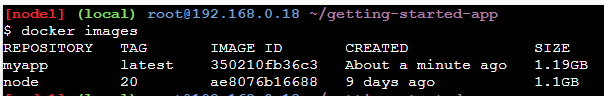
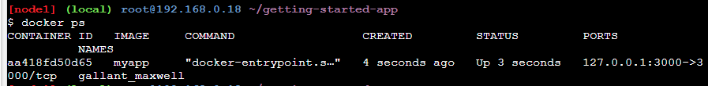
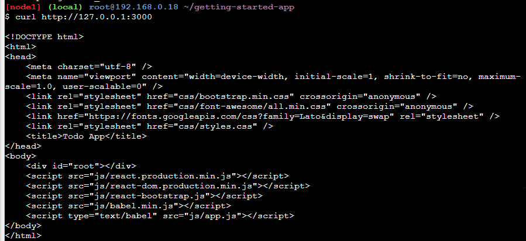

# Docker 基本概念 (4)

## 前言

前一篇中介紹了 Parent Image 的概念，接下來就要用它來建立自己的映像檔，這邊需要透過 Dockerfiles 來進行相關的配置。

## Dockerfile 是什麼?

Dockerfile 是一個文字檔案，用來建立 Docker Images 的指令檔案，用它就能夠客製化自己的映像檔。

Dockerfile 主要的目的是告訴 docker 要如何建立具有不同層的映像檔；Dockerfile 中的每一個指令，都是獨立一行的指令，一般來說，每一行指令，通常代表的是映像檔中不同的層級。

接下來介紹一些 Dockerfile 中會用到的基本指令
**FROM**

> FROM \<image\>

就是 parent image 作為第一層

**WORKDIR**

> WORKDIR "指定工作目錄"

指定工作目錄

**COPY**

> COPY "本機目錄" "Image 目錄"

表示複製本機的檔案到 Image 的哪個位置

**RUN**

> RUN npm install

通常是用來在 docker 建立 Image 的時候會去執行的指令，像是上面的指令就是會進行套件的安裝

**CMD**

> CMD ["node", "index.js"]

在容器執行時，要他去執行的指令

**EXPOSE**

> EXPOSE 3000
> 也就是要公開哪一個 port

### 使用範例

接下來使用 docker 官方教學提供的專案檔案建立一個 docker image 出來

1. 首先透過 git 下載專案

```bash
git clone https://github.com/docker/getting-started-app.git
```

2. 查看下載的檔案有哪些



3. 建立 Dockerfile
   接下來在專案資料夾底下建立一個 Dockerfile 的檔案

記得要在專案根目錄底下建立

```bash
touch Dockerfile
```



4. 編輯 Dockerfile
由於我們在前一篇中有先下載 node:20 的映像檔，所以我繼續沿用，這樣就不用再額外下載不同版本的 node.js 映像檔了。

 ```yaml
 FROM node:20
 WORKDIR /app
 COPY . .
 RUN yarn install --production
 CMD ["node", "src/index.js"]
 EXPOSE 3000
 ```

以上就完成 Dockerfile 檔案的撰寫了

## 建立映像檔

當 Dockerfile 腳本寫好之後，就可以建立出映像檔了

語法如下

```bash
docker build -t myapp .
```

> - -t 的指令是代表幫這個映像檔取個名字
> - . 的話代表的是 dockerfile 的相對位置

建立的過程如下：



等它建立完成之後，就可以用 docker images 指令看到我們建立的 myapp 映像檔了。



## 將建立的映像檔跑起來
這邊將映像檔跑起來變成容器

```bash
docker run -d -p 127.0.0.1:3000:3000 myapp
```

使用 docker ps 指令查看是否順利跑起來



使用 curl 工具查看是否連的到 docker 容器的伺服器

```bash
curl http://127.0.0.1:3000
```

可以看到順利請求到 html 的檔案



## 相關連結
[Play with Docker](https://labs.play-with-docker.com/)

[Docker 官方教學文件](https://docs.docker.com/guides/workshop/)

[Docker Hub](https://hub.docker.com/)

## 系列文章

[Docker 基本概念 (1)-Docker 是甚麼](https://bingfenghung.github.io/blog/articles/Docker%3C_%3E%3EDocker%20%E5%9F%BA%E6%9C%AC%E6%A6%82%E5%BF%B5%20(1))

[Docker 基本概念 (2)-映像檔與容器](https://bingfenghung.github.io/blog/articles/Docker%3C_%3E%3EDocker%20%E5%9F%BA%E6%9C%AC%E6%A6%82%E5%BF%B5%20(2))

[Docker 基本概念 (3)-父映像檔](https://bingfenghung.github.io/blog/articles/Docker%3C_%3E%3EDocker%20%E5%9F%BA%E6%9C%AC%E6%A6%82%E5%BF%B5%20(3))

[Docker 基本概念 (4)-使用 Dockerfile 建立映像檔](https://bingfenghung.github.io/blog/articles/Docker%3C_%3E%3EDocker%20%E5%9F%BA%E6%9C%AC%E6%A6%82%E5%BF%B5%20(4))

[Docker 基本概念 (5)-Docker 常用指令](https://bingfenghung.github.io/blog/articles/Docker%3C_%3E%3EDocker%20%E5%9F%BA%E6%9C%AC%E6%A6%82%E5%BF%B5%20(5))
