# Docker 基本概念 (5)

## 前言

前一篇介紹了如何用 Dockerfile 建立自己的映像檔，不過在最後讓映像檔跑成容器的時候有一堆指令。本篇將針對前面提過以及重要的 docker 指令進行說明，算是一個總整理。

## docker pull 下載指定的映像檔
透過 docker pull 可以下載指定映像檔的最新版本，如果要下載指定版本的映像檔需要在映像檔後面加上冒號跟上版本號碼。

**1. 下載最新的映像檔版本**

```bash
docker pull node
```

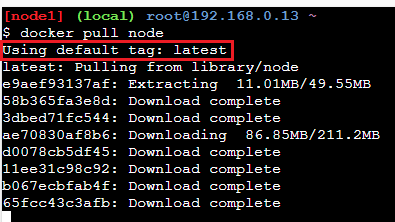

可以看到預設標籤是 lastest

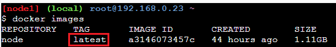

<hr>

**2. 下載指定的映像檔版本**
```bash
docker pull node:20
```

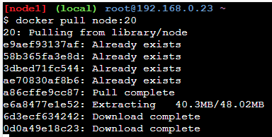

可以看到順利下載指定的版本號

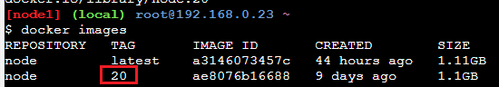

## docker images 列出本機上的映像檔
列出所有的 docker 映像檔，如下圖所示：

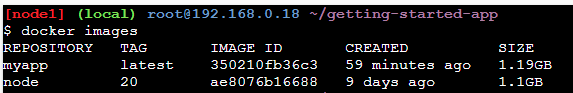

上面欄位的名稱如下：
- REPOSITORY：映像檔的倉庫名稱。
- TAG：映像檔的標籤，代表版本號。
- IMAGE ID：映像檔的唯一識別碼，用於識別映像檔的雜湊值。
- CREATED：映像檔被建立或是更新的時間
- SIZE：映像檔的大小

## docker rmi 刪除指定的映像檔
如果要刪除映像檔的話，可以透過 docker rmi 指令

```bash
docker rmi <映像檔識別碼>
# or 
docker rmi <REPOSITORY:TAG>
```

**1. 透過映像檔識別碼進行映像檔刪除**
```bash
docker rmi d2c9
```

基本上識別碼只要輸入 IMAGE ID 的前四個數字即可，如下圖所示：

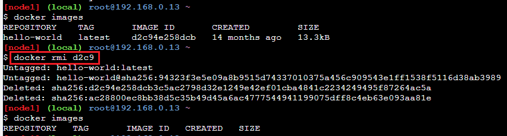

**2. 使用 REPOSITORY 的名稱進行刪除**，
```bash
docker rmi hello-world:latest
```

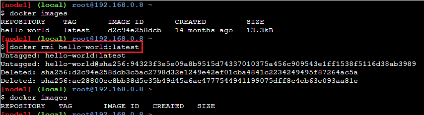

## docker ps 列出執行中的容器
透過 docker ps 指令可以查看當前有在執行的容器。

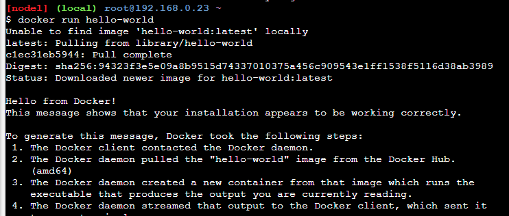

上圖可以看到目前有一個 nginx 的容器正在執行中。

順便說明一下上面的欄位名稱的意思，以下是每個欄位的意義：
- CONTAINER ID: 容器的唯一識別碼，是一個縮短的雜湊值。
- IMAGE: 容器所使用的映像檔名稱。
- COMMAND: 啟動容器時運行的命令。通常是容器啟動後第一個執行的指令或腳本。
- CREATED: 容器建立的時間。
- STATUS: 容器的當前運行狀態。
- PORTS: 容器開放的網絡端口和使用的通訊協議。
- NAMES: 容器的名稱。這是 Docker 自動生成或使用者自定義的名稱，用於容易識別容器。

## docker ps -a 列出所有的容器
如果要查看所有的容器，就需要下 docker ps -a，它會列出有啟動與停止的所有容器。

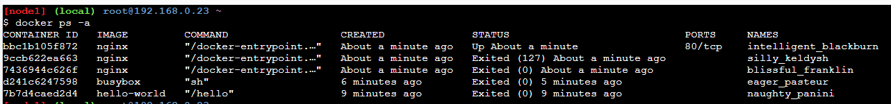

## docker run 跑一個容器起來
要快速跑一個容器起來很簡單，只需要下如下的指令即可
```bash
docker run \<映像檔\>
```

這個動作會先檢查本機上是否有指定的映像檔，如果沒有的話，它會先進行 pull 的動作，然後再跑容器起來，如下圖所示：

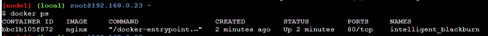

### 容器命名
如果啟動容器的時候，沒有給定容器名稱的話，那麼系統就會自動地幫你的容器命一個名稱，這個名稱是隨機的，為此，我們會想要指定容器的名稱，只需要在 docker 指令的裡面加上 --name

```bash
docker run --name server nginx
```

✨ 記得映像檔要放在指令的最後面

### 容器的 port 匹配
由於容器的 port 只有在容器公開，並沒有與我們的本機掛勾，因此，我們無法透過在本機端連到容器內的 port。

為此，我們需要匹配我們本機端的一個 port 到容器裡面的 port，這樣我們才能從本地端使用到容器內的服務，為此，需要用到 -p 的指令，完整指令如下：

```bash
docker run --name server -p 3000:80 nginx
```

✨ 注意 -p 參數後面的值，左邊的 3000 代表的是本地端要匹配的 port，右邊的 80 則是容器內公開的 port。

### 背景執行容器
使用 docker run 指令預設是會在前景執行的，但是在前景執行的話，會影響我們操作其他指令，為此，如果要讓終端機不會被占住，可以在啟動的時候多加一個 -d (detached flag) 的指令，這樣就可以讓容器在背景執行了。

```bash
docker run --name server -p 3000:80 -d nginx
```
### 容器結束後自動刪除
有時我們僅想要測試容器，測試結束時想要讓容器可以自動刪除，可以在指令上多加上 --rm 的指令，這樣只要在容器結束的時候就會自動刪除容器。

```bash
docker run --name server -p 3000:80 -d --rm nginx
```

## docker start 將停止中的容器啟動
要讓停止中的容器再次啟動，只需要下 docker start 容器名稱或是 Container id，即可再次啟動容器，如下圖所示：

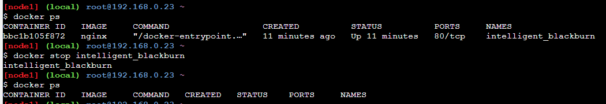

## docker stop 將執行中的容器停止
想要讓容器停止，只需要下 docker stop 接著容器的名稱或是 Container id 即可讓容器停止。

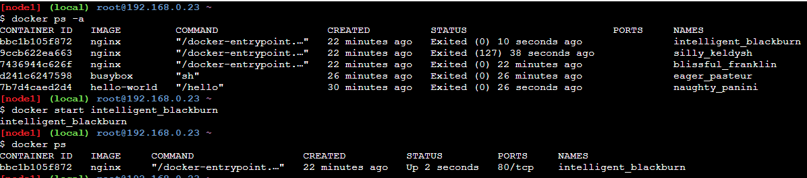

## docker rm 刪除指定的容器
刪除指定的容器跟上面一樣，指定容器名稱或是 Container id，即可順利移除，但是前提是容器並不能正在執行中，否則會無法刪除。

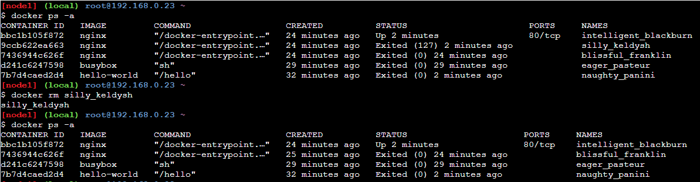

✨ 如果對於 docker 要帶什麼參數或是指令，可以透過 docker --help 的方式進行查詢。

## 相關連結
[Play with Docker](https://labs.play-with-docker.com/)

[Docker 官方教學文件](https://docs.docker.com/guides/workshop/)

[Docker Hub](https://hub.docker.com/)


## 系列文章

[Docker 基本概念 (1)-Docker 是甚麼](https://bingfenghung.github.io/blog/articles/Docker%3C_%3E%3EDocker%20%E5%9F%BA%E6%9C%AC%E6%A6%82%E5%BF%B5%20(1))

[Docker 基本概念 (2)-映像檔與容器](https://bingfenghung.github.io/blog/articles/Docker%3C_%3E%3EDocker%20%E5%9F%BA%E6%9C%AC%E6%A6%82%E5%BF%B5%20(2))

[Docker 基本概念 (3)-父映像檔](https://bingfenghung.github.io/blog/articles/Docker%3C_%3E%3EDocker%20%E5%9F%BA%E6%9C%AC%E6%A6%82%E5%BF%B5%20(3))

[Docker 基本概念 (4)-使用 Dockerfile 建立映像檔](https://bingfenghung.github.io/blog/articles/Docker%3C_%3E%3EDocker%20%E5%9F%BA%E6%9C%AC%E6%A6%82%E5%BF%B5%20(4))

[Docker 基本概念 (5)-Docker 常用指令](https://bingfenghung.github.io/blog/articles/Docker%3C_%3E%3EDocker%20%E5%9F%BA%E6%9C%AC%E6%A6%82%E5%BF%B5%20(5))