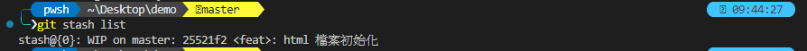

# Git Stash 把當前撰寫的程式碼暫存起來

很常碰到一種狀況，正在開發中的程式，因為突然需要對原本的版本進行程式碼的修改，但是，原本正在撰寫中的程式碼要怎麼辦呢?

因為還在開發中的原因，也沒辦法對當前所撰寫的程式碼進行提交的動作，此時，就需要使用到 git stash 了，先將正在撰寫中的程式碼進行暫存的動作，等到要修改的程式碼修改完成之後，再將這個暫存還原回原本正在撰寫中的程式碼。

這邊先列出 git stash 常用到的指令

首先假設我原本專案，裡面有一個基本的 html 檔案，且最新的提交紀錄如下圖 1
所示：

圖 1、最新 git 提交紀錄

今天我正在對這個檔案進行程式碼撰寫的動作，如下圖 2 所示：

圖 2、新增程式碼

現在突然有臨時的工作，需要先把手邊這個正在撰寫中的程式碼先暫存起來，只需要下
git stash，首先，先使用 git status 查看檔案修改的變化，然後使用 git
stash 暫存當前的工作，如下圖 3 所示：

圖 3、使用 git stash 暫存

當暫存過後，可以發現原本的 html 檔案已經還原回去一開始的內容了，如下圖 4
所示：

圖 4、檔案還原

可以使用 git stash list 查看暫存列表，如下圖 5 所示：

圖 5、git stash 列表

再來你可能完成了手邊的工作，需要把剛剛的暫存紀錄還原，使用 git pop
就能夠把剛剛手邊還在撰寫的程式碼還原回來了，如下圖 6 所示：

圖 6、暫存記錄還原

使用還原之後，可以看到程式碼變回剛剛手邊在撰寫的程式碼內容了，如圖 7
所示：

圖 7、開發中的內容還原

假設今天還原回去原本版本中修改了內容，並且提交到儲存庫之後，在使用 git
stash 回來，就需要進行衝突解決。

假設今天有很多 stash 如果要還原指定的 stash，可以使用 git stash pop
stash@{n} 就能指定要還原的暫存紀錄了。
