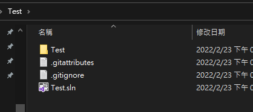
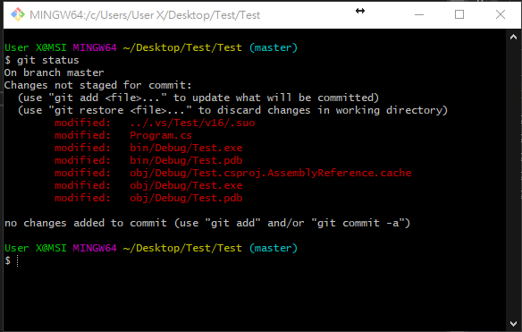

# Git 將已受版本管控但包含在 .gitignore 中的檔案移出版本管控

通常有些檔案並不希望被版本管控，會在 .gitignore 檔案中定義；但是，如果是檔案已經是在版本管控的階段了，後面才加入 .gitignroe 的檔案配置，該檔案是不會被排除的，為此，本篇將介紹如何將如何重新將不需要的檔案排除在版本管控。

專案中已經有 .gitignore 檔案，排除 Visual Studio
某些不必要的檔案，如下圖 1 所示：

圖 1、.gitignore 檔案加入所有檔案在版本管控之後

但是由於，.gitignore
檔案是在其他檔案加入版本管控後才加入的，會導致納些不必要的檔案還是受到版本管控，下圖為未加入
.gitignore 的版本管控顯示，如下圖 1 所示

圖 2、不需要版本管控的檔案還是受到管控

只需一個簡單的指令

> \# Remove everythin from the index (the files will stay in the file
system)
> 
> \$ git rm --r ---cached .

透過這個指令將所有檔案重新變成未受版本管控的檔案，此時 .gitignore
檔案的功能就有作用了，此時只要再重新把檔案加回版本管控中，下次檔案有變更時，就不會再將已受
.gitignore 排除的檔案，又偵測變更。
