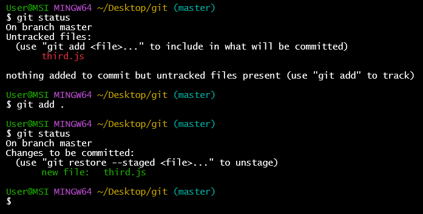
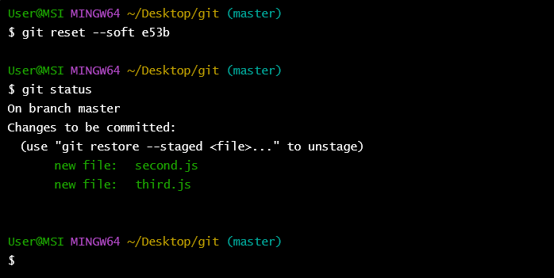
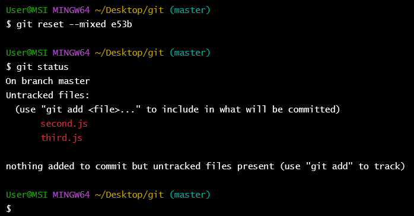
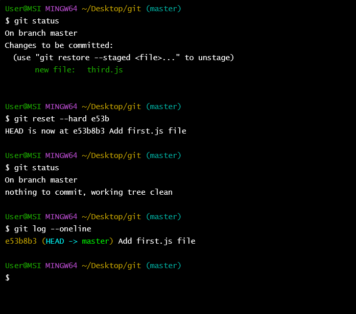

# git reset

git reset 用來還原版本，讓你可以返回之前的提交狀態，接下來要針對三個常用的 git reset 模式進行說明：

## git reset 三種模式

git reset 三個模式分別為：soft、mixed、hard

--hard: 移動 HEAD，丟棄所有變更 (包含工作目錄和索引中的變更)
--mixed: 移動 HEAD，將變更保留在工作目錄中，但會從索引移除。
--soft: 移動 HEAD，但會將變更保留在索引中

## 情境操作

為了說明，先建立一下操作情境，

```sh
mkdir git 
cd git 
git init
```

加入檔案編輯後提交

```sh
echo "console.log('first')" > first.js
git add first.js
git commit -m "Add fisrt.js file"
```

建立另一個新檔案並提交變更

```sh
echo "console.log('second')" > second.js
git add second.js
git commit -m "Add second.js file"
```

使用 git log --oneline 查看當前提交歷史

```sh
7e92b87 (HEAD -> master) Add second.js file
e53b8b3 Add first.js file
```

1. **soft 模式**
   git reset --soft `<commit>`

   將 HEAD 移動到指定的 commit，但不會改變索引或是工作目錄。

   所有從指定 commit 到當前 commit 之間的變更都會被保留在索引中，就像剛執行 git add 一樣

   情境： 現在我新增了一個 third.js 的檔案，然後加入至 staged 狀態

   

   現在使用 git reset --soft e53b8b3

   
   可以看到他移動到前兩個 commit 的點，並且原本 second.js 的檔案也變成 staged 的狀態了。
2. **mixed 模式**
   git reset --mixed `<commit>` (git rest 的預設選項)
   將 HEAD 移動到指定的 commit，並且更新索引以匹配該 commit，但是不會變更工作目錄。意味著從指定提交到當前提交之間的變更會被保留在工作目錄中，但不在索引中。

   情境：也是一樣新增了一個 third.js 的檔案，並且加入到 staged

   

   接下來使用 git reset --mixed e53b8b3

   

   這次可以看到原本 third.js 已經有加入到 staged 狀態，以及原本 second.js 是在 commit 的記錄的，但下完指令之後，他們都變成 Untracked 檔案的狀態
3. **hard 模式**
   git resset --hard `<commit>`
   這個選項會將 HEAD、索引和工作目錄都重設到指定的提交。所有從該提交到當前提交之間的變更都會被丟棄。

   情境：也是一樣新增了一個 third.js 的檔案，並且加入到 staged

   

   接下來使用 git reset --hard e53b8b3

   

   原本在裡面的 third.js 檔案整個被刪除掉了。

## 總結

簡單來說

--hard 會將檔案 stage 連同檔案本身都移除  (檔案刪除)
--mxied 會將檔案由原本在 stage 的狀態，回到 unstage 狀態，但是檔案會保留 (檔案保留、unstaged)
--soft 感覺主要用在移動到指定的 commit，只是說原本有 commit 的檔案會變成 staged 狀態 (檔案保留、staged)
