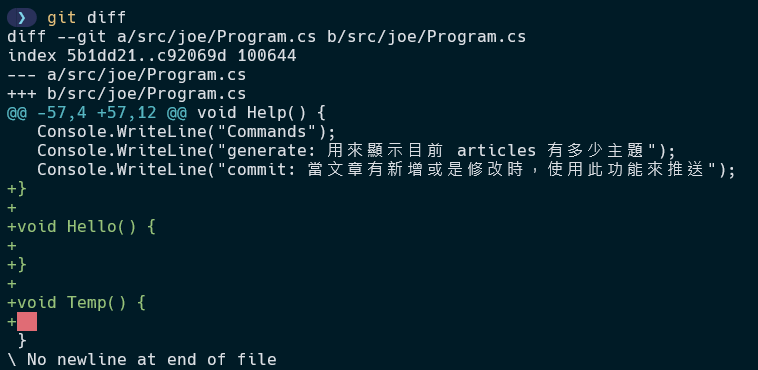
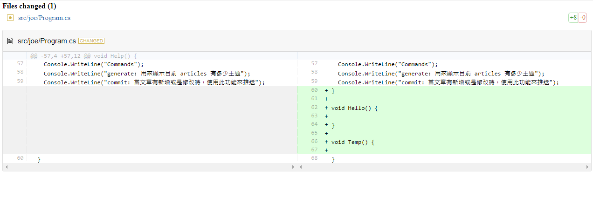

# 增加 Git Diff 可讀性

## 前言
每次在提交 git 紀錄變更之前，會先透過 **git diff** 指令查看此次變更修改了什麼或是新增了什麼，不過由於 git diff 在終端機顯示出來的結果比較不具備可讀性，閱讀起來並不是那麼的便利，顯示結果如下圖 1 所示：



最近發現一個套件 diff2html，發現它做出來的效果還不錯，因此，就在想如果我是否能夠直接在終端機下指令後，然後就有一個美美的比較畫面呈現。為此，本篇將介紹如何透過 C# Console 程式，搭配 node.js 將這個較有可讀性的 git diff 功能整合在一起。

## 需要的工具
- C# Console
- Node.js 
- Playwright 套件
- diff2html

##  實作發想
建立一個 node.js 的專案，並安裝 playwright 套件，用這個套件主要是要讓我們能夠載入 diff 的檔案結果，並且顯示一個網頁起來，這邊要顯示的網頁，也就是要使用 diff2html 這個套件，這邊使用 cdn 引入的方式，方便使用。

最後再使用 C# Console 開發，是因為想要把 git 指令與 node 的功能整個串起來。

## git diff 網頁
此網頁就是要將 git diff 結果顯示的網頁，它裡面有一個 displayDiff 的函數，這邊會透過 playwright 套件，將指定的 diff 字串傳進來，傳進來之後在顯示這個網頁出來給使用者觀看。

```html
<!DOCTYPE html>

<html>

<head>
    <link rel="stylesheet" type="text/css" href="https://cdn.jsdelivr.net/npm/diff2html/bundles/css/diff2html.min.css" />
    <script type="text/javascript" src="https://cdn.jsdelivr.net/npm/diff2html/bundles/js/diff2html-ui.min.js"></script>
</head>

<body>
    <div id=report></div>
    <script>
        function displayDiff(diffText) { 
            var targetElement = document.getElementById('report'); 
            var configuration = { 
                drawFileList: true,
                fileListToggle: false,
                fileListStartVisible: false,
                fileContentToggle: false,
                matching: 'lines',
                outputFormat: 'side-by-side',
                synchronisedScroll: true,
                highlight: true,
                renderNothingWhenEmpty: false, 
            };
            var diff2htmlUi = new Diff2HtmlUI(targetElement, diffText, configuration);
            diff2htmlUi.draw();
            diff2htmlUi.highlightCode();
        }
    </script>
</body>

</html>
```

## node 專案建置
先進行專案初始化，開啟一個資料夾，將其命名為 git_diff，並在專案資料夾底下建立一個 gui 的資料夾，預計將上面的 git diff 顯示的 diff.html 放在此路徑底下以及 git diff 的訊息結果也放在這個資料夾底下。

```bash
npm init -y
```

安裝 playwright 套件

```bash
npm install playwright
```

專案資料夾結構如下

```
git_diff/
│
├── node_module/                    
├── package.json
├── package-lock.json                    
│   └──── gui/           # 放要呈現的網頁與 diff 文字檔
│      ├── diff.html     # git diff 呈現的 html 網頁 
│      └── diff.txt      # git diff 紀錄文字檔
├── index.js
└── .gitignore 
```

在專案根目錄底下，建立一個 index.js 的檔案，程式碼如下所示：

```js
const { chromium } = require('playwright');
const fs = require('fs').promises; 
const path = require('path')

const htmlFile = path.resolve(__dirname, 'gui', 'diff.html'); 
const diffFile = path.resolve(__dirname, 'gui', 'diff.txt'); 

async function openPersistentBrowser(htmlFile, diffFile) {
    const userDataDir = './persistent_user_data';
    const browserContext = await chromium.launchPersistentContext(userDataDir, {
        headless: false,
    });

    const page = browserContext.pages().length > 0 ? browserContext.pages()[0] : await browserContext.newPage();

    const htmlPath = `file://${htmlFile}`;
    await page.goto(htmlPath);

    // 讀取 diff.txt 檔案
    const diffText = await fs.readFile(diffFile, 'utf8');

    // 使用頁面中的函數顯示 diff 文本
    await page.evaluate((diff) => {
        displayDiff(diff);
    }, diffText);

    // 腳本在這裡結束，但瀏覽器將保持開啟
}

openPersistentBrowser(htmlFile, diffFile);
```

## C# Console
建立一個 C# Console 的應用程式，接下來就可以把相關的指令串接起來了

### git diff 結果儲存
C# 這邊需要做透過 Process 類別進行指令的呼叫，程式碼如下所示：

```cs
using System.Diagnostics;

class ProcessCommand 
{
  private readonly string  _workDirectory;
  public ProcessCommand(string workDirectory)
  {
    _workDirectory = workDirectory;   
  }
  
  public bool Command(string command, string args, out string output) 
  {
    output = string.Empty;

    try {
      ProcessStartInfo processStartInfo = new ProcessStartInfo(command, args) {
        RedirectStandardOutput = true,
        UseShellExecute = false,
        WorkingDirectory = _workDirectory
      };
      
      using (Process process = new Process()) 
      {
        process.StartInfo = processStartInfo;
        process.Start();
        output = process.StandardOutput.ReadToEnd();
        process.WaitForExit();
      }

      return true;     
    } catch {
      return false;
    }
  }
}
```

建立一個 ProcessCommand 類別來處理終端機指令的呼叫

接下來就可以將所有的功能串接起來了，程式碼如下所示：

```cs
ProcessCommand processCommand = new ProcessCommand(Environment.CurrentDirectory);

processCommand.Command("git", "diff", out string output);

// 儲存到 node 專案底下的 gui 資料夾裡面
var nodeRootPath = $@"C:\gitDiff";

// 儲存檔案
File.WriteAllText(Path.Combine(nodeRootPath, "gui", "diff.txt"), output);

// 顯示結果
var indexPath = Path.Combine(nodeRootPath, "index.js");
processCommand.Command("node", $"\"{indexPath}\"", out output);

Console.WriteLine("Complete");
```

完成之後，執行結果如下圖所示：


