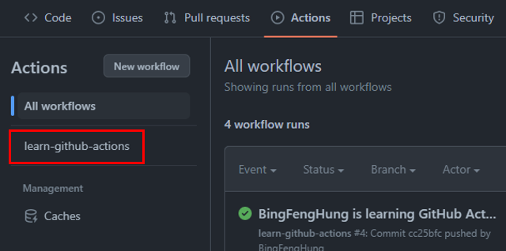
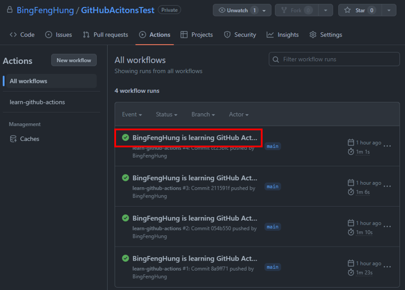
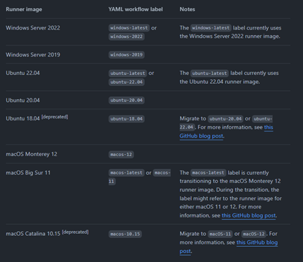
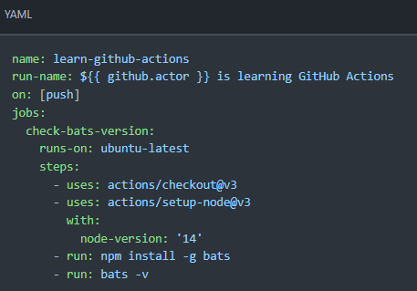

# GitHub Actions 介紹

GitHub Actions 是一個 CI/CD 的平台，讓你能夠自動化建置、測試與部屬。GitHub 將這些操作稱為 Actions。
很多操作在不同的專案裡面都是相似的，GitHub 利用這一點，允許開發人員將每個操作寫成獨立的腳本，放到儲存庫中，讓其他開發人員能夠引用。因此，當需要某個 Action 的時候，就不用再自己撰寫腳本，直接使用其他人寫好的 Action 就可以，整個 CI/CD 的過程，就變成了一個 Actions 的組合。

## GitHub Actions 基本概念
`Workflows`：一個可配置的自動化流程，可以執行一或多個 jobs。  
`Events`：觸發 workflows 工作的特定事件，例如：pull request、issue、push commit、排程  
`Jobs`：由多個 step 組成，會在同一個 runner 裡面運行  
`Step`：執行腳本或是 Action，可一次執行一個或多個 Action。  
`Actions`：GitHub Actions 平台的自定義應用程式，可執行複雜但是重複的任務  
`Runners`：Runner 是一個伺服器，會執行 workflows 裡面定義的 Jobs，每個 Runner 一次只能執行一個 Job。  

## 撰寫 workflow 檔案

在 GitHub 儲存庫中建立 `.github/workflows` 的資料夾，這個資料夾裡面會放置我們的 workflow 配置檔案；workflow 配置檔案使用 YAML 格式，其副檔名為 yml。當 GitHub 只要發現 .github/workflows 資料夾裡面有 .yml 檔案，就會自動執行該檔案。

下面介紹一些基本的 workflow 內容配置

### 1. name

name 是 workflow 的名稱，若省略此設定，預設為當前 workflow 檔案的名稱。

### 2. run-name
顯示在 workflow runs 列表上面的名稱

### 3. on
on 是指觸發指定 workflow 工作的條件或是事件
<pre>
on: [push]
</pre>

還能夠根據分支或是標籤觸發事件

<pre>
on:  
   push:  
      branches:  
         -master
</pre>

在 master 分支發生 push 事件的時候，觸發 workflow

4. jobs
Jobs 裡面需要些出每一項 job 的具體名稱定義 (job_id)。
job_id 裡面的 name 是說明文字

<pre>
jobs:  
 my_first_job:  
    name: My first job  
  my_second_job:  
    name: My second job    
</pre>

jobs.<job.id>.needs
needs 指定當前任務的依賴關係，也就是執行的順序

<pre>
jobs:   
 job1:
 job2:  
   needs: job1  
 job3:  
   needs: [job1, job2]  
</pre>

上面的執行順序為 job1、job2、job3

jobs<job.id>.runs-on
runs-on 指定的是執行時所需的虛擬機環境

<pre>
jobs:   
 job1:  
   runs-on: ubuntu-latest
</pre>

jobs<job.id>.steps
steps 裡面定義執行的步驟，每個步驟都可以指定以下三個設定
- jobs.<job_id>.steps.name： 步驟名稱
- jobs.<job_id>.steps.run： 執行的命令或是 Action
- jobs.<job_id>.steps.env：環境變數

jobs<job_id>.uses
使用 GitHub 上面其他人寫好的 Action

## 參考資料
- https://github.com/marketplace?type=actions
- https://docs.github.com/en/actions/learn-github-actions/understanding-github-actions?learn=getting_started&learnProduct=actions#actions
- https://www.ruanyifeng.com/blog/2019/09/getting-started-with-github-actions.html
