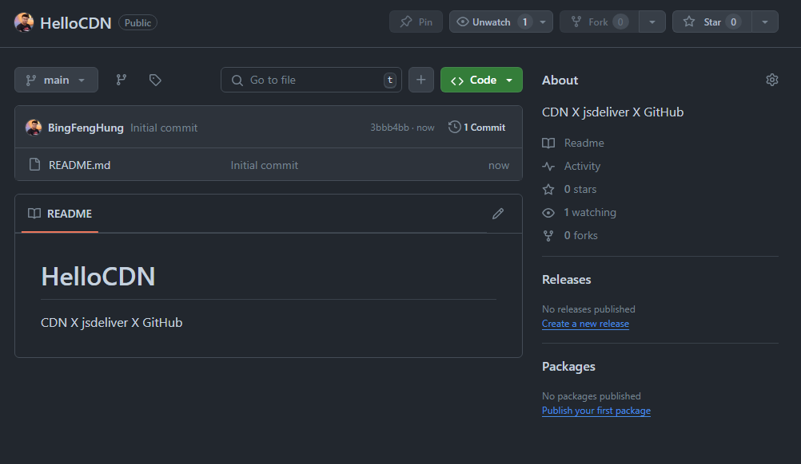
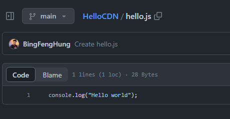
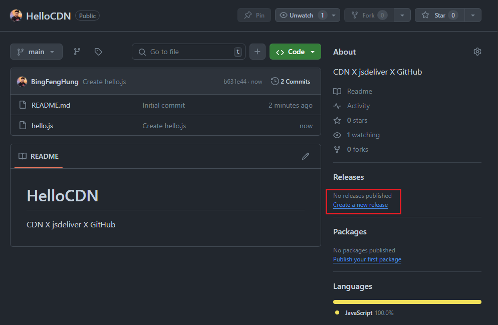
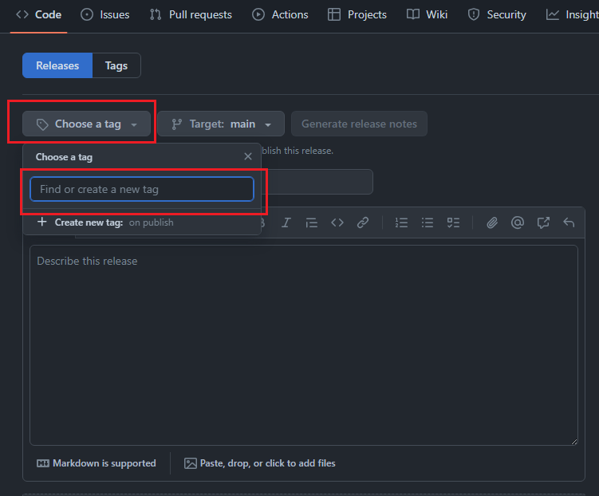
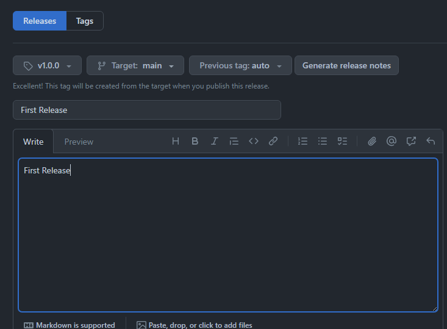
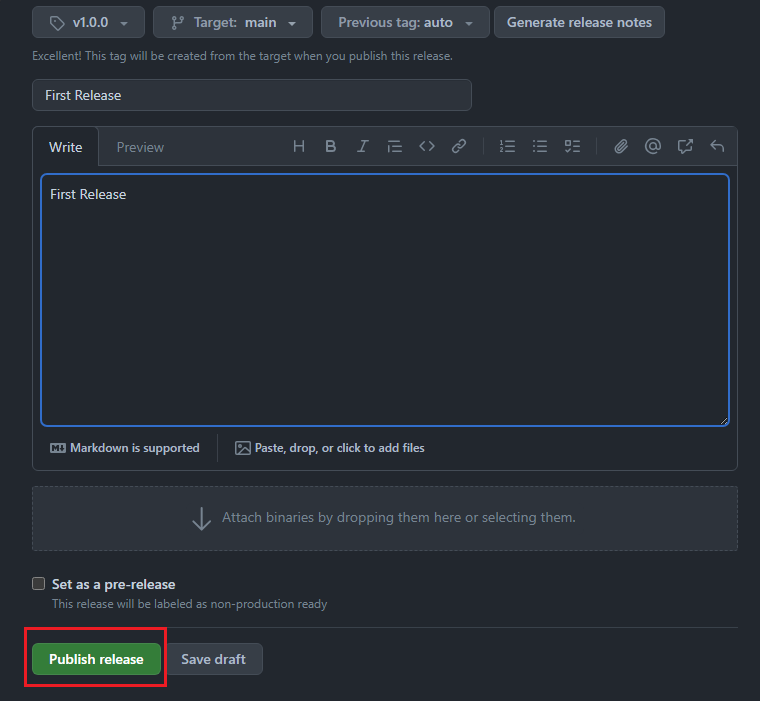
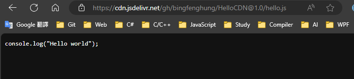

# 免費的 cdn 製作方法

## 前言
在開發網頁相關的應用程式的時候，有兩種方式能夠引入外部的函式庫進來使用，一種是透過套件管理工具 (npm、yarn) 等工具將函式庫下載下來引入使用；另外一種方式，就是透過 cdn 的方式，引入使用。

以 CDN 來說，適合小型的專案或是測試使用。CDN (Content Delivery Network) 內容分發網路。透過部屬在世界各地的邊緣服務器，依據最靠近使用者的伺服器，快速可靠的將相關影音資源、檔案甚至是應用程式傳送給使用者使用。

## 如何讓自己開發的函式庫能透過 CDN 存取呢?
這邊將透過 GitHub 發布一個應用的方式，並結合 jsdeliver，讓我們能夠使用到我們自行開發的函式庫。

首先，到 GitHub 網站上新建立一個儲存庫，記得該儲存庫要是公開的，建立之後如下圖所示：




然後再儲存庫中建立一個 hello.js 的檔案，程式內容單純用 console 印出 Hello world，程式碼如下：

```js
// hello.js
console.log("Hello world");
```

建立完成之後畫面如下：




接著來到最重要的環節，把專案發布出來，點選專案目錄的 Releases 標籤，新建立一個 release，根據上面的指示填完版本 (1.0)，發布標題與內容之後，就能夠按下發布。



Tag 按鈕那邊點一下，然後輸入一下發布的版本，假設是 v1.0.0，如下圖所示：



將一些資料填寫一下，如下圖所示:



填寫完成之後，到畫面最下方按下 Publish Release 的按鈕



發布完成之後，我們就能夠過以下的網址路徑儲存到我們在 github 上面的檔案了如下所示：



```
https://cdn.jsdelivr.net/gh/BingFengJoe/HelloCDN@1.0/hello.js

https://cdn.jsdelivr.net/gh/<使用者名稱>/<專案名稱>@<版本號>/<欲存取的檔案>
```

接下來就能在 html 檔案中透過 `<script src="">` 的方式引入使用了。
