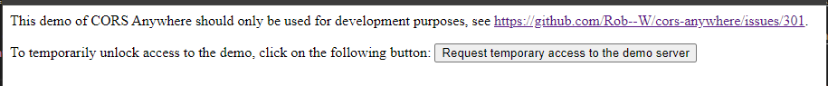

# 使用 cors anywhere 暫時解決本地端跨網域請求問題 (cors)

在開發階段想要向不同網域請求 API 的時候，通常都會碰到 CORS 跨網域請求的問題，此時的作法是，建立一個後端的伺服器，然後用這個後端的伺服器進行請求，前端的部分，就去跟這個後端的伺服器請求資料，達到一個代理伺服器中轉請求的概念。

不過這樣的做法對於一些只是要做簡單的測試來說，步驟稍微有點多，因為如果只是想要簡單測試一下請求跨網域的 API，還要搭建後端伺服器，過程太過麻煩了。

為此，cors-anywhere 這個專案就是要解決此問題，讓你在開發過程中，能夠快速地進行測試，他使用的方法很簡單，只需要在你要請求的網址前面再多加上他的網址即可，作法如下：

> https://cors-anywhere.herokuapp.com/ 後面跟上指定的 api url

```html
<script type="text/javascript">
  const url = 'https://favqs.com/api/qotd'
  const cors = 'https://cors-anywhere.herokuapp.com/'
  
  document.addEventListener('DOMContentLoaded', async() => {
    const res = await fetch([cors, url].join(''))
    const data = await res.json()
    
    document.body.innerHTML = JSON.stringify(data)
  })
</script>
```

不過這邊有一點要記得，每次使用前要先到 https://cors-anywhere.herokuapp.com 的網頁上面，按一下按鈕才能正常使用，畫面如下：


按下 **Request temporary access to the demo server** 按鈕之後就能夠正常使用了

## 參考資料
- [GitHub: cors-anywhere](https://github.com/Rob--W/cors-anywhere)