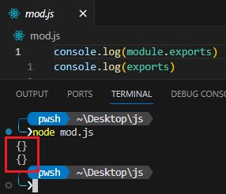
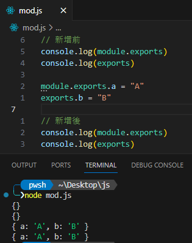
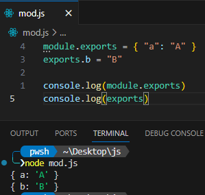
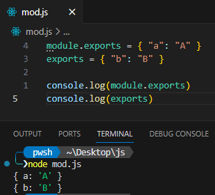

# Node.js CommonJS 模組說明

Node.js 的 CommonJS 模組可用來將 JavaScript 以模組化的方式管理，讓程式碼更具組織性；接下來將說明 CommonJS 模組的使用。

在 Node.js 中，每一個 js 檔案都被視為是一個獨立的模組。那現在的重點就是，要如何引入模組以及導出模組。

首先說明導出模組，導出模組的時候，主要有兩個關鍵字能夠使用，module.exports 與 exports，這兩個有什麼差別呢？

使用 console 將這兩個關鍵字輸出出來看，程式碼如下圖 1 所示：

圖 1、輸出 module.exports 與 exports 關鍵字

輸出可以發現，這兩個是空的物件，既然是空的物件，那麼我們就能夠透過他們給這個物件加上一些屬性，如下圖 2 所示：

圖 2、透過 module.exports 與 exports 加上屬性

可以發現各自加上屬性之後，這兩個關鍵字輸出出來的內容都是一樣的，這就表示這兩個關鍵字都是使用同一個物件，正確地來說，exports 是參考到 module.exports 的物件，這就說明，使用 exports 新增屬性上去的時候，也就會加到 module.exports 物件上面。

但有一點要注意，如果說將 module.exports 重新賦予一個新的物件的時候，後面再使用 exports 加上屬性，並不會將該屬性加入到 module.exports 裡面，程式碼如下圖 3 所示：

圖 3、module.exports 指派新的物件

可以明顯地看到輸出結果已經是兩個不一樣的內容。

或是如果在 exports 重新指派新的物件，也並不會影響到 module.exports
的物件，程式碼如下圖 4 所示：

圖 4、exports 指派新的物件

可以看到一樣也是兩個不一樣的物件內容。

若想要知道原理可以參考下圖 5 程式碼：

圖 5、module.exports 與 exports

參考來源：[Modules: CommonJS modules \| Node.js v21.1.0 Documentation
(nodejs.org)](https://nodejs.org/docs/latest/api/modules.html#exports-shortcut)

以上大致介紹完模組導出的概念

接下來介紹引入模組的概念，這個就簡單許多，只需要使用 require
就可以引入模組了，程式碼如下圖 6 所示：

圖 6、引入模組

這樣就能順利引入模組使用了。
