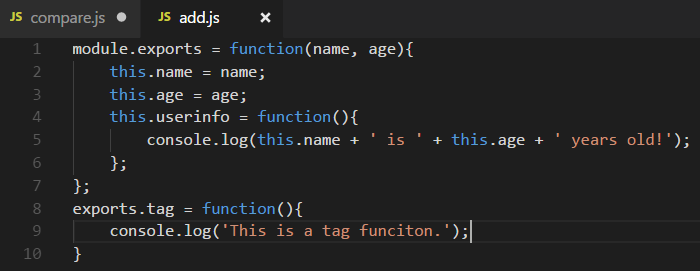
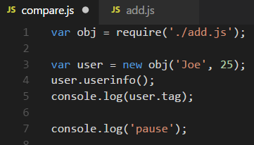
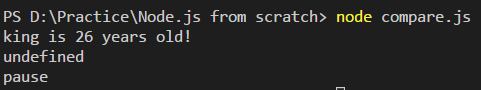

# Node.js module.exports 與 exports 之間的差異

在 Node.js 中，module 模組提供了 exports 物件，他與 module.exports
物件指向同一個變數，因此在修改 exports 物件時也會同時修改 module.exports
物件。但是可以發現如果 module.exports
進行操作，在其內容不為空的情況下，會發現 exports
物件就失效了，這是為甚麼呢?本篇主要探討者兩個物件之間差異，探討其上述原因。

首先介紹一下 module.exports 物件與 exports 物件的區別，以下為程式碼：

等待被引入的 js 檔

引入上面的 js 檔，並 new 使用其內容

結果：

可發現由 exports.tag 輸出的函式是 undefined。這是因為其實，module.exports 才是 module 模組的真正介面，而 exports 可以理解他為一個副本，雖然修改 exports 物件的時候也會修改 module.exports 物件，但是駔後返回給使用者是 module.exports 物件而非 exports 物件。因此，當 module.exports 物件透過賦值方式進行設定後，已經與 exports 物件指向的變數不同了，此時無論 exports 物件如何修改，都已經與 module.exports 無關了。
