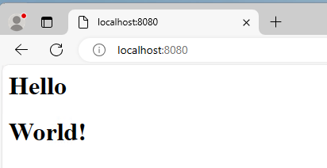

# Node.js http 模組

如果要建立伺服器，在 Node.js 裡面能夠使用內建的 http 模組就能夠快速的建立伺服器，以下將介紹建立的步驟：
## 建立伺服器
### 建立專案資料夾
開啟一個空白的資料夾，在此資料夾下開啟終端機下指令

> $ npm init -y

### 修改模組導入導出方式
建立完專案之後，可以看到多了一個 package.json 的檔案，打開他因為我們要使用 esmodule 的方式，所以我們需要修改一下專案配置，在裡面新增一個 type 屬性，屬性值為 module。

```json
{
   ...
   "type": "module"
   ...
}
```

### 開始撰寫程式碼
然後建立一個 index.js 的檔案，就可以開始撰寫程式碼了

首先先引入 http 模組

```js
import http from "node:http";
```

然後指定一下要監聽的 port

```js
import http from "node:http";
const PORT = 8080
```
### http.createServer() 方法
再來建立伺服器使用 http 模組的 createServer 方法，這個方法裡面接收一個箭頭函式，此箭頭函式有兩個參數 req 與 res。

req 來自客戶端的相關資訊

res 要回傳給客戶端的東西

```js
import http from "node:http"
const PORT = 8080

const server = http.createServer((req, res) => {
})
```

### 設定 header
我們先假設我們要回傳一個 html 的網頁，可以這樣做，先指定 header

```js
import http from "node:http"
const PORT = 8080

const server = http.createServer((req, res) => {
   res.setHeader('Content-Type': 'text/html')
})
```

上面指定就是說明要回傳 html 的格式

### 設定狀態碼
接下來指定一下回傳的 statusCode，為了表示正常我們回傳 200

```js
import http from "node:http"
const PORT = 8080

const server = http.createServer((req, res) => {
   res.setHeader('Content-Type': 'text/html')
   res.statusCode = 200  // 回傳 200 狀態碼
})
```

### 設定回傳的內容 (html 檔案)
再來我們就能撰寫要回傳的 html 內容了，這邊使用 res.write() 方法設定要回傳的內容，這邊有一點要注意，結束的時候一定要呼叫 res.end() 方法，才能讓客戶端瀏覽器知道結束了，否則會一直等待在那邊。

```js
import http from 'node:http'
const PORT = 8080

const server = http.createServer((res, req) => {
   res.setHeader('Content-Type': 'text/html')
   res.statusCode = 200
   
   res.write('<h1>Hello</h1>')
   res.end('<h1>World</h1>')
})
```

上面的程式碼完成之後，當客戶端對我們的伺服器進行請求的時候，就會顯示 Hello World 的字樣了。

### 監聽指定的 PORT
目前伺服器還無法順利執行，因為還沒有監聽 PORT，再來就是要讓伺服器監聽

```js
import http from 'http:node'
const PORT = 8080

const server = http.createServer((res, req) => {
   res.setHeader('Content-Type': 'text/html')
   res.statusCode = 200
 
   res.write('<h1>Hello</h1>')
   res.end('<h1>World!</h1>')
})

server.listen(PORT, () => {
   console.log(`Listen on PORT: ${PORT}`)
})
```

### 顯示結果
執行 index.js，開啟終端機，然後下指令

> $ node index.js



## 各式各樣的 Content-Type
除了回傳 html 檔案格式之外，我們其實還有其他的內容可以回傳，如下所示：
```js
res.setHeader('Content-Type', 'text/html')
res.setHeader('Content-Type', 'text/plain')
res.setHeader('Content-Type', 'application/json')
res.setHeader('Content-Type', 'application/xml')
res.setHeader('Content-Type', 'application/javascript')
res.setHeader('Content-Type', 'application/css')
```

另外除了個別設定 setHeader 與 statusCode，其實能夠使用 writeHead 方法一次指定

```js
res.writeHead(200, { 'Content-Type': 'application/json' })
```

## 針對不同的路由回傳不同的內容 (req.url)
當我們要根據客戶端不同的路由決定要回傳什麼內容給他們，我們能夠使用 req.url 方法

透過 req.url 方法，針對不同的路由進行不同的處理

```js
// ...
const server = http.createServer((req, res) => {
  if (req.url === '/') {
    res.setHeader('Content-Type', 'text/html');
    res.statusCode = 200
    res.end(`<h1>Hello</h1>`)

  } else if (req.url === '/api') {
    res.writeHead(200, { 'Content-Type': 'application/json'})
    res.end(JSON.stringify({ msg: 'My Message' }))
  } else {
    res.writeHead(404, { 'Content-Type': 'text/html'})
    res.write(`<h1>Oops!!!</h1>`)
    res.end(`<h2>404</h2>`)
  }
})
// ...
```