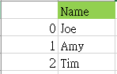

# Python Pandas_Series
## Pandas 三大資料結構
1. Series 欄位 (單維度)
2. DataFrame 表格 (兩維度)
3. Panel 三維表格  (特殊需求之外很少用到)

## Series 欄位
**series 是一個欄位**

下圖是一個 series 的示意圖:



Pandas 的 Series 是單維陣列，由值 (value) 與索引 (index) 組成

### 使用 list 建立 Series
透過將 list 資料作為參數傳入到 Series 方法中，即可建立 Series

**預設 index**
```py
import pandas as pd
letter = pd.Series(['a', 'b', 'c']) # 不指定 index，預設是 0, 1, 2
print(letter)

"""
0    a       
1    b       
2    c       
dtype: object
"""
```

可以看到 Pandas 會自動產生索引，並且是從 0 開始的，不過我們可以透過 index 參數來指定不同的索引

**自定義 index**
```py
import pandas as pd
letter = pd.Series(['a', 'b', 'c'], index=['No.1', 'No.2', 'No.3'])
print(letter)

"""
No.1    a
No.2    b
No.3    c
dtype: object
"""
```

### 使用字典建立 Series
```py
import pandas as pd

data = {'No.1': 'a', 'No.2':'b', 'No.3': 'c'}
letter = pd.Series(data)

"""
No.1    a
No.2    b
No.3    c
dtype: object
"""
```

字典的 key 會變成 series 的 index，字典的 value 會變成 series 的 value

### 使用常數建立 seris
```py
import pandas as pd

num = pd.Series(10)
print(num)
"""
0    10
dtype: int64
"""

num = pd.Series(10, index=[0, 1, 2])
print(num)

"""
0    10
1    10
2    10
dtype: int64
"""
```

## series 資料索引
```py
import pandas as pd
countries = pd.Series(['Taiwan', 'Japan', 'Korea', 'USA', 'UK'])

print(countries[0])  # 取出索引值 0 的資料

print(countries[1: 4]) # 取出索引 1 到 3 的資料
```

## Series 屬性

```py
import pandas as pd

countries = pd.Series(['Taiwan', 'Japan', 'Korea', 'USA', 'UK'])
print(countries.values)  # ['Taiwan', 'Japan', 'Korea', 'USA', 'UK']
print(countries.size)    # 5
print(countries.index)   # RangeIndex(start=0, stop=5, step=1)
print(countries.dtype)   # object
print(countries.shape)   # (5,)
```
