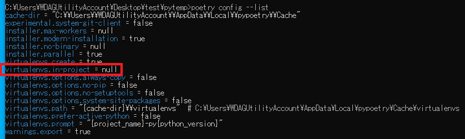

# Python poetry 套件管理工具

poetry 類似於 pip 的套件管理工具，但他還提供了虛擬環境的建立，以及套件相依性的管理

## 為甚麼不使用 pip?
在說明 pip 之前，應該要介紹虛擬環境

通常在開發 python 專案的時候，都會使用虛擬環境建立一個獨立的環境，避免不同專案之間的套件互相衝突，因為有可能我這個專案使用了這個版本的套件，但是另外一個專案使用了不同版本的套件，導致這個專案能順利執行，另外一個專案卻無法順利執行。

再來說明 pip，pip 會負責進行套件的下載，但是他卻沒有相依性的管理，也就是說，我今天使用了這個套件，但我要移除他的時候，他並沒有將相關他有使用到的套件也一併移除，就留著其他的套件在上面，整個專案環境就污染了。

## poetry 安裝
在 poetry 官方網站中有提供幾種安裝方式，這邊說明手動安裝的方式，因為用這種方式，當我不想要使用 poetry 的時候，直接刪除資料夾就可以移除乾淨了。

```sh
python3 -m venv $VENV_PATH
$VENV_PATH/Scripts/pip install -U pip setuptools
$VENV_PATH/Scripts/pip install poetry
```

透過上面的指令安裝好之後，可以把 $VENV_PATH 加入環境變數中，方便直接呼叫 poetry 檔案使用。

這邊我先用 cmd 指令簡單設定環境變數

```sh
# %cd% 當前路徑
set PATH=%cd%\Scripts;%PATH%
```

上面這樣就能指定臨時的 PATH，所以就使用 poetry 這個套件管理工具，來進行管理

### poetry 重點
poetry 這邊有一個重點要注意，就是因為 poetry 會幫我們建立虛擬環境，如果希望虛擬環境跟著專案資料夾一起的話，需要檢查一下以下的指令

> poetry config --list



裡面列表可以看到 virtualenvs.in-project = false

這邊要將它設定為 true

> poetry config virtualenvs.in-project true

下完之後，就可以在專案裡面有虛擬環境，而不是用全域的虛擬環境

全域的虛擬環境在 %LocalAppData%\pypoetry\Cache 資料夾裡面
