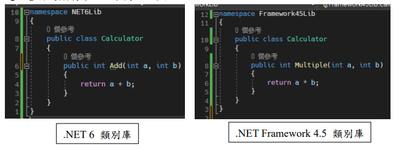
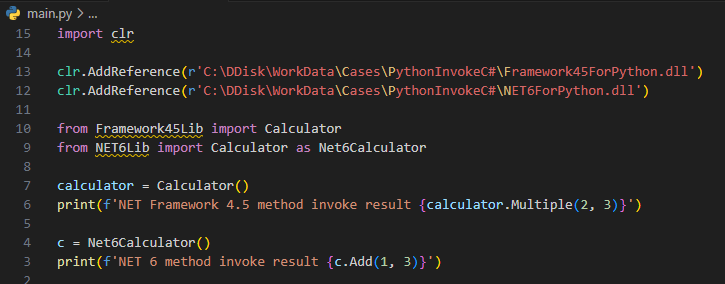
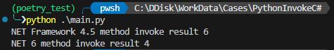

# Python 呼叫 C# 程式碼

最近發現 Python 功能的強大，比較能夠體會為什麼 Python 叫做膠水程式，他能夠很容易地跟其他程式語言做整合。由於 Python 的執行效率不高，一般來說，如果想要加快運算速度的話，通常會透過 Python 去呼叫 C/C++ 的程式來執行，以此來提高程式執行的效率。

平常比較常使用的語言是 C#，想要了解是否能夠透過 Python 去呼叫 C# 的函式，發現作法相當的簡單，為此，本篇將介紹如何使用 Python 去呼叫 C# 程式。

在此之前，有一點需要特別注意，Python 的位元必須要跟 dll 的位元是一致的，也就是 32 位元對應 32 位元，64 位元對應 64 位元。

首先需要先去安裝 pythonnet 的套件，透過這個套件可以將 Python 與 .NET CLR 整合再一起。

\> pip install pythonnet

再來建立 .net 專案，這邊我會建立 .NET 6 的類別庫與 .NET Framework 4.5 的類別庫，測試是否能夠順利地引入使用。

建立各自的類別庫，如下圖 1 所示：

圖 1、C# 類別庫建立

接下來在 Python 中就能夠引入 dll 使用，引入 clr 套件，在來使用 clr.AddReference 方法，裡面給定 dll 的絕對路徑，就能夠將 dll 引入到 Python 中做使用，再來就是引入 C# 中的類別，from 命名空間 import 類別的格式引入，完整程式碼如下圖 2 所示：

圖 2、完整 Python 呼叫 C# 程式碼

再來就可以執行 Python 查看執行結果，結果如下圖 3 所示：

圖 3、執行結果

**參考資料:**

https://github.com/pythonnet/pythonnet
