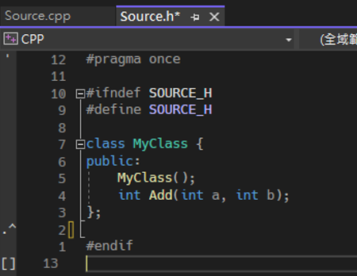

# Python 如何使用 C++ 類別
這邊將使用 Visual Studio 2022 建立出原生的 C++ 類別，然後再 Python 裡面去實例化這個物件，使用物件方法，最終將其釋放。
首先建立 C++ 專案，選擇空白專案，如下圖 1 所示：

圖 1、新增 C++ 空白專案

輸入想要的專案名稱，並選擇專案要放置的位置，如下圖 2 所示：

圖 2、專案名稱與專案位置指定
開啟方案總管找到我們建立的專案，對裡面的來源檔案 (Source Files) 點選右鍵，加入新增項目，如下圖 3 所示：

圖 3、新增項目

選擇 C++ 檔案，並輸入檔案名稱，如下圖 4 所示：

圖 4、新增 CPP 檔案
然後也加入一個標頭檔，對標頭檔資料夾 (Header Files) 點選右鍵，新增項目，選擇標頭檔，跟上面的步驟差不多。

接下來，就要在標頭檔那邊先定義類別，如下圖 5 所示：

圖 5、定義類別

然後再到 cpp 檔案那邊將類別方法建立出來，如下圖 6 所示：

圖 6、類別實作

接下來就要讓這個類別，可以被外部使用，回到標頭檔的地方，程式碼如下圖 7 所示：

圖 7、公開類別與其方法

裡面的 extern “C” 是指編譯器會將裡面的函式當作 C 語言風格的函式，而非 C++ 的函式，這樣做的目的是確保外部程式碼能夠正確呼叫裡面的函式。
__declspec(dllexport) 是一個 Microsoft Visual C++ 的指令，用來將函式與類別從 DLL 中匯出的標記，這樣可以讓這些函式與類別在 DLL 中可供外部程式碼使用，注意 __declspec(dllexport) 並不是標準的 C++ 語法，因此在其他平台上面的編譯器無法使用。

接下來就可以在  Python 中使用這個 DLL 匯出的方法了，這邊會使用 Python 的 ctypes 套件，讓我們能夠呼叫 C++ 的函式，完整程式碼如下圖 8 所示：

圖 8、Python 使用 dll 呼叫 C++ 類別方法

輸出結果，如下圖 9 所示：

圖 9、執行結果

接下來說明程式碼：
-	mydll = ctypes.CDLL('./CPP.dll')，這行程式碼建立了一個 mydll 物件。可以使用 mydll 物件來呼叫這個 DLL 中的函式。
-	class MyClass(ctypes.Structure)，這個部分是在定義一個 MyClass 類別，它只是一個空的類別定義，為了稍後的使用做準備。
-	mydll.MyClass_new.restype = ctypes.POINTER(MyClass)，這行程式碼指定了 MyClass_new 函數的返回類型，該函數返回一個指向 MyClass 類別的指標。
-	my_class = mydll.MyClass_new()，這行程式碼呼叫了 MyClass_new 函數，並將其返回的指標存在 my_class 變數中。
-	result = mydll.MyClass_Add(my_class, 10, 20)，這行程式碼呼叫了 MyClass_Add 的函式，並給定了 my_class 物件以及兩個整數參數 (10 和 20)。函式的結果存儲在 result 變數。
-	mydll.MyClass_del(my_class) 這行程式碼呼叫了 MyClass_del 函數，用來釋放先前分配的 my_class 物件。
