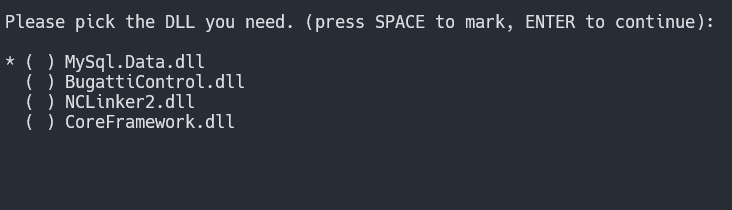

# Python 建立一個 dll 檔案安裝器

開發過程中，常常需要選擇加入 dll
到專案中，每次都要重複這個步驟，稍嫌麻煩，為此，開發一個 dll_import
功能，這樣只要在指定的資料夾下，開啟終端機，並且下 dll_import
指令，就能夠選擇要載入的 dll 檔案了。

首先，將常用的 dll 放在某一個資料夾中，透過 Python 的一個套件 picker
可以做到在 CLI 介面有選擇的功能，接下來，就是要處裡 dll
檔的問題了，由於要載入的 dll 檔案，有需會相依再一起，因此，另外設計一個
json 檔案，用來決定這些檔案相依性，這樣選擇 dll
檔案的時候，我只需要選擇具代表性的 dll 檔案就可以了。

由於 Windows 不像 Linux
修改檔案屬性，就能夠將腳本檔案，變成執行檔，為此，需要使用 PyInstaller
的工具，將 python 檔案轉成 exe 檔案

-   pyinstaller --onefile script.py

然後將打包出來的 exe 檔案，放到環境變數指定的 Path
資料夾中，方便可以全域呼叫。

建立完成之後，以後只要在專案的指定資料夾中，開啟終端機，並且選擇需要的
dll，就能夠自動載入，不用再自己手動拖曳檔案，方便許多。

後續再研究如何使用 dotnet cli 工具加入 dll
的參考，讓他可以一下完指令，專案也加入好 dll 的參考。

程式執行結果：

