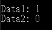
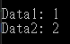

# C# 傳遞結構值到 C++ 發生變數值不一樣的問題

最近學到如何從 C# 傳遞結構給 C++ 使用，但是在使用的過程中，發生了為什麼我在 C# 那邊指定的結構屬性值，到 C++ 那邊卻整個不一樣，這個問題整整困擾了我許久，最後發現原來只是一個簡單的錯誤，特此用這篇記錄一下。

先來看看一開始出錯的結構，C++ 結構定義，程式碼如下所示：

```cpp
typedef struct Temp {
  long Data1;
  long Data2;
} TEMP;
```

以及 C++ 公開出來的方法，裡面的程式碼就是單純將 Temp 結構的兩個屬性給輸出出來，程式碼如下所示：

```cpp
// Test.cpp
#include <iostream>

extern "C" {
  __declspec(dllexport) int ExecuteTemp(TEMP* data) {
    std::cout << "Data1: " << data->Data1 << std::endl;
    std::cout << "Data2: " << data->Data2 << std::endl;
    return 0;
  }
}
```

再來就是 C# 這邊，也是定義一個結構，要與 C++ 匹配，如下程式碼所示：

```cs
[StructLayout(LayoutKind.Sequential)]
public struct TEMP {
  public long Data1;
  public long Data2;
}
```

然後就進行 C++ 函式庫的呼叫，這邊使用 DllImport 的方式，先將 C++ dll 給引入，並且引用裡面的方法，程式碼如下所示：

```cs
[DllImport("CPPTEST.dll", CallingConvention = CallingConvention.Cdecl)]
public static extern int ExecuteTemp(ref TEMP input);

public static void Main()
{
    TEMP temp = new TEMP();
    temp.Data1 = 1;
    temp.Data2 = 2;

    ExecuteTemp(ref temp);
}
```

到這邊程式碼執行的時候，預期會輸出 Data1 等於 1，以及 Data2 等於 2 的輸出，結果執行出來，結果並不如預期，畫面如下圖 1 所示：



圖 1、輸出結果錯誤

會發生這個原因，結果是因為 **C# 與 C++ 那邊 long 的型別大小並不一樣**，在 C# 這邊 long 的大小是 64 位元，而 C++ 如果是 x86 架構他的 long 大小是 32 位元，如果是 x64 架構才是 64 位元。

由於我的 C++ 專案是使用 x86 架構的，所以導致我的 C# 那邊使用 long 型別是不對的，應該要改為 int 型別，C# 的 int 型別是 32 位元，這樣才有辦法與 x86 的 C++  long 型別做匹配。

將 C# 結構修改為正確的 int 型別，程式碼如下所示：

```cs
[StructLayout(LayoutKind.Sequential)]
public struct TEMP {
  public int Data1;
  public int Data2;
}
```

這次再重新執行程式碼，就有正確的將結構的數值給取得到了，結果如下圖 2 所示：



圖 2、結果正確輸出
