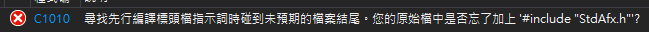
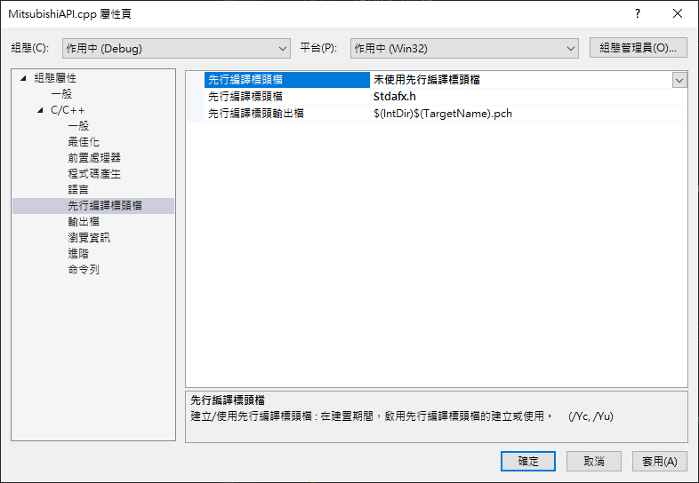
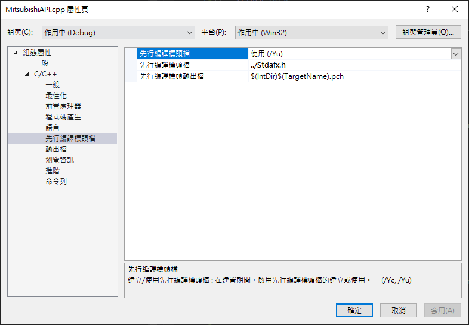

# Visual Studio C++ C1010 忘記加上 StdAfx.h 錯誤

在使用 Visual Studio 寫 C++ 的時候，碰到"C1010 尋找先行編譯標頭檔指示詞時碰到未預期的檔案結尾。您的原始檔中是否忘記加上 #include "StdAfx.h" 的錯誤，如下圖 1 所示：

圖 1、C1010 錯誤

StdAfx.h 是一個先行編譯的檔案，因為每個 cpp 檔案屬性預設都是使用先行編譯標頭檔 (/Yu) 的，因此，如果加入新的 cpp 或是加入的第三方檔案沒有 #include "stdafx.h"，會出現這個錯誤。

針對這個問題，通常有兩個解決方式，針對 cpp 檔案，點擊右鍵屬性，把先行編譯標頭檔，改為未使用先行編譯標頭檔，如下圖 2 所示：

圖 2、未使用先行編譯標頭檔

第二種方式，是將 cpp 檔案開加入 #include "stdafx.h" 的檔案，這樣就能夠解決問題，不過如果該 cpp 檔案，不跟 stdafx.h 的檔案在同一個目錄下，必須將使用相對路徑的方式找到 stdafx.h 的檔案，然後引入標頭檔時，也是使用相對路徑的方式找到該檔案，如下圖 3 所示：

圖 3、修改 stdafx.h 路徑
