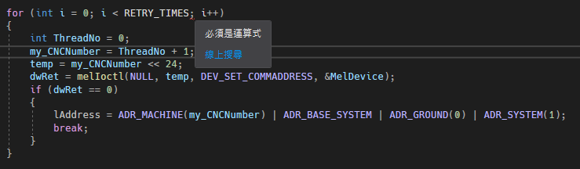
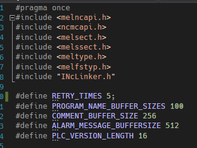

# Visual C++ for 迴圈能否使用 #define 的值

使用 #define 宣告的值是在編譯之前就先宣告好的，在使用 #define 宣告的值的時候，確一直無法順利編譯通過，如下圖 1 所示：

圖1、無法使用 #define 的值

RETRY_TIEMS 是預先定義的值，但是，確一直說必須是運算式，回頭看 #define 的地方，發現 RETRY_TIMES 後面多了一個分號，把分號取消之後，一切就正常了，如下圖 2 所示：

圖 2、#define 多了不必要的分號
