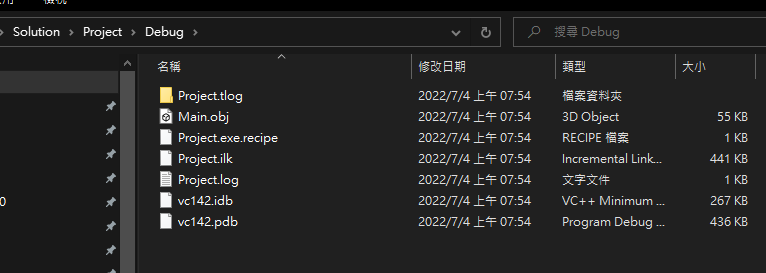
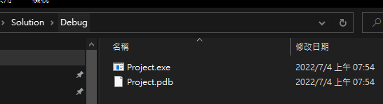
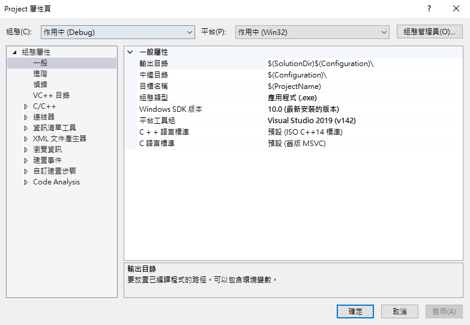
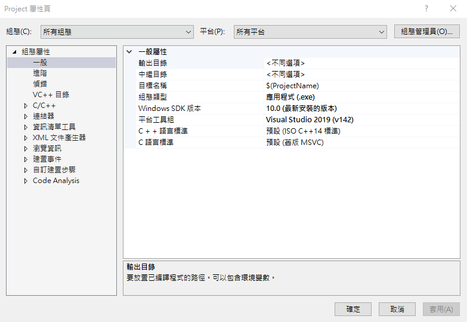
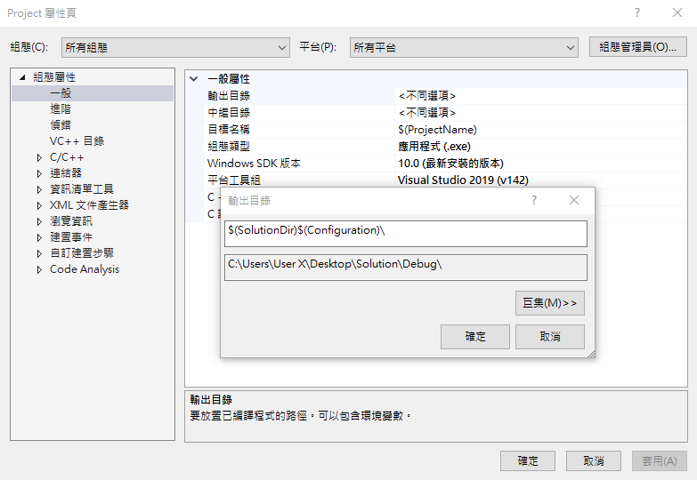
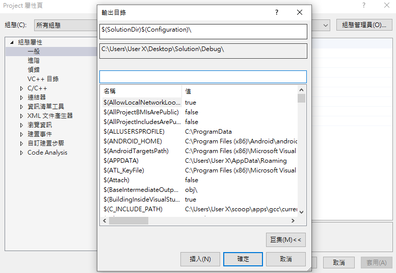
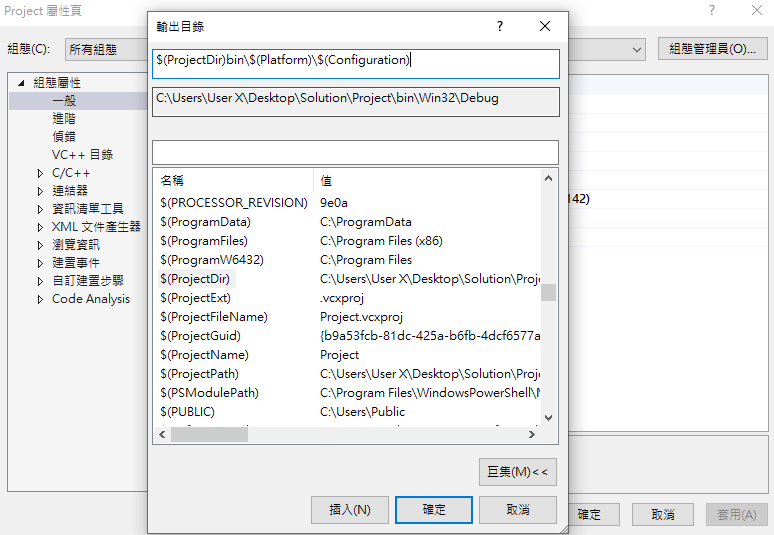
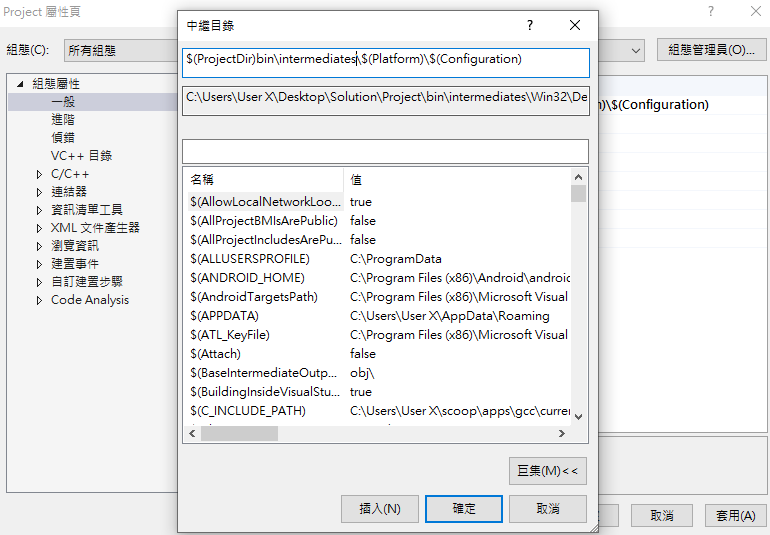

# Visual C++ 變更編譯後的執行檔輸出路徑

在編譯 C++ 專案的時候，其專案目錄底下的 Debug
資料夾是放置中間檔案的資料夾，如果要找到編譯檔案，必須在與解決方案同一目錄底下的
Debug 資料夾中才能找到。習慣了 C#
專案結構的人，可能第一次看到會不太習慣；為此，本篇將介紹，如何自定義輸出檔案路徑的位置。

首先，先來看 Visual Studio 預設的檔案編譯位置。假設，建立了一個名為
Solution 的解決方案，底下有一個 Project
的專案，其中間檔案預設放置於專案目錄 Debug 資料夾底下，如下圖 1 所示：

圖 1、中間檔案位置

專案編譯出來的執行檔，會放在與 Solution 解決方案同一層目錄底下的 Debug
資料夾裡面，如下圖 2 所示：

圖 2、執行檔案位置

如果想要變更輸出路徑的位置，在 Visual Studio
中，對專案的檔案點擊右鍵，然後找到屬性，之後會開啟專案的屬性頁，如下圖 3
所示：

圖 3、專案屬性頁

開啟專案屬性頁面之後，首先，先調整組態為所有組態，平台選擇所有平台，如下圖
4 所示：

圖 4、修改組態與平台配置

然後看到組態屬性 一般屬性，裡面有輸出目錄與中繼目錄

首先，修改輸出目錄，旁邊有下拉式選單可以點選，點選編輯可看到目前輸出的路徑，如下圖
5 所示：

圖 5、編輯輸出目錄

然後巨集的按鈕，裡面有相關變數說明可以使用，如下圖 6 所示：

圖 6、巨集變數查詢

接下來就可以修改輸出路徑的位置，假設將專案的執行檔輸出路徑改在專案底的
bin 資料夾底下，然後將中繼檔案的輸出路徑也改在專案底下的 bin
資料夾底下，如下圖 7 與圖8所示：

圖7、輸出目錄路徑指定

圖 8、中繼目錄路徑指定

修改完成之後，就可以看到在指定資料夾生出對應的檔案了。
