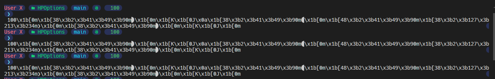

# Visual Code 終端機顯示亂碼問題

## 問題

最近 Visual Code 更新之後發現終端機都會有亂碼顯示，畫面如下圖 1 所示：

上去 Visual Code GitHub 上面也是有人有同樣的問題，雖然官方說有修好，但目前看起來還是沒有解決此問題

## 解決方法

先到這個路徑下載這個檔案 **shellIntegration.ps1**

[vscode/src/vs/workbench/contrib/terminal/browser/media/shellIntegration.ps1 at 1e790d77f81672c49be070e04474901747115651 · microsoft/vscode (github.com)](https://github.com/microsoft/vscode/blob/1e790d77f81672c49be070e04474901747115651/src/vs/workbench/contrib/terminal/browser/media/shellIntegration.ps1#L22)

然後再將檔案貼到

~\AppData\Local\Programs\Microsoft VS Code\resources\app\out\vs\workbench\contrib\terminal\browser\media

這個資料夾底下進取代

然後重新開啟 Visual Code 就不會再看到亂碼了
