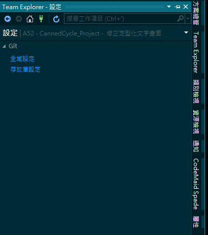

# Visual Studio 2017 如何產生 git ignore 檔案

在進行版本管控時，通常有些項目並不是我們所需要進行管控，例如：一些我們不在乎的檔案、系統自行產生的檔案或是資料庫的存取密碼等等的檔案；上述的項目，基本上放到版本管控中，沒有任何意義甚至會照成版本管控上的複雜，為此可以加入一個
.gitignore
的檔案，把不需要版本管控的項目都寫在這個檔案中，但是平常我們最常使用的開發軟體
Visual Studio
這個軟體會產生很多沒有實質利用價值的檔案，一個一個的把檔案加入到
.gitignore 太過於麻煩且繁瑣了，為此本篇旨在介紹，如何使用 Visual Studio
2017 自動產生 gitignore 檔案，並且內建所有不需要版控的項目。

在 Visual Studio
開發環境下，預設會有很多系統檔案產生的，而這些檔案並不是我們所關心的也不是版本控管想要管理的，如下圖
1 所示：

圖1、多餘的系統檔

下面說明，如何使用 Visual Studio 產生 gitignore
檔案，避免版控不需要的系統檔，

先點選 Visual Studio 的方案總管，點選 Team Explorer，如下圖2所示：

圖2、選擇 Team Explorer

點選 Team Explorer 後會進入如下圖3，Visual Studio Git
工具的首頁，點選設定

圖3、Visual Studio Git 工具首頁

點選設定後會進入設定頁面，並選擇存放庫設定，如下圖4所示：

圖4、存放庫設定

進入存放庫設定後，找到忽略屬性檔案的群組，在忽略檔案的地方點選加入，如下圖5所示：

圖5、忽略屬性檔案

點選加入後，Visual Studio 會自動幫此專案加入一個 .gitignore
的檔案，如下圖6所示：

圖6、加入 .gitignore 檔案

點開該 .gitignore
檔案後可以發現裡面已經有加入所有不需要進行版本控制的設定了，如下圖7所示：

圖 7、.gitignore
