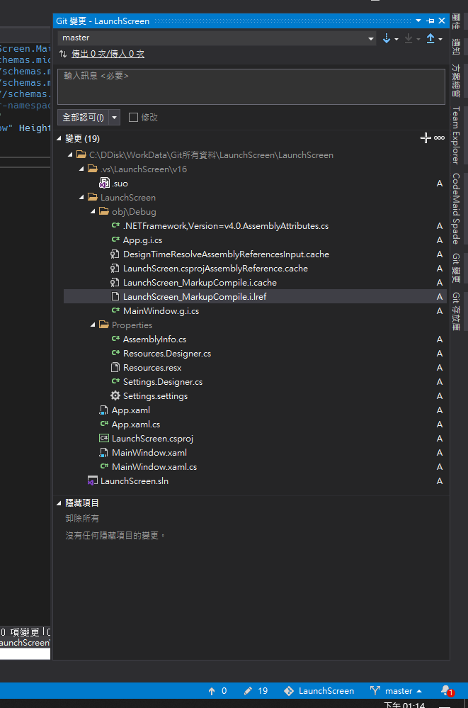
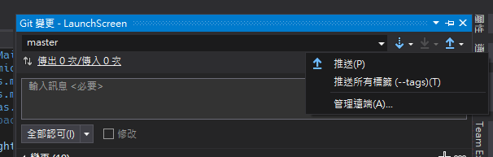
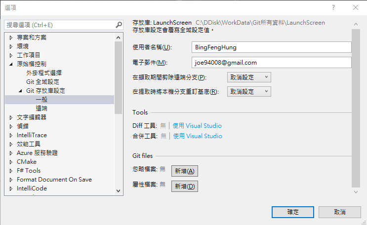
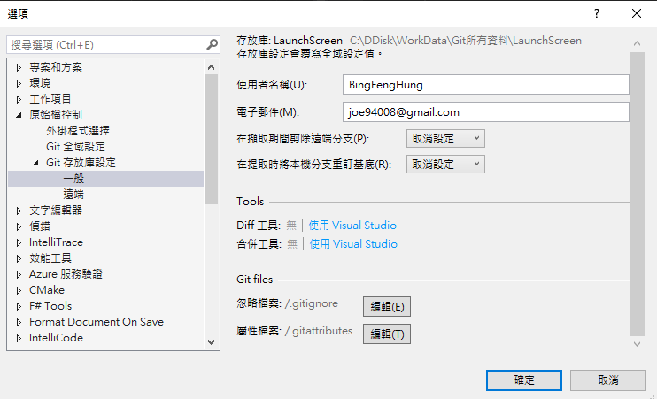

# Visual Studio 2019 加入 gitignore 檔案

最近 Visual Studio 一直改版，而最近比較大變動的就屬 Git
的部分，原本的加入 gitingore
的位置比較好找，結果這次大變動，導致這項功能的位置也改變了，找了很久才發先原來他藏在設定裡面。

首先，先開啟專案的 Git 變更，如下圖 1 所示：

圖 1、開啟 Git 變更

然後選擇右上角點開推送旁邊的標籤，並點擊管理遠端，如下圖 2 所示：

圖 2、開啟管理遠端

點開後，會跳至選項頁面，下左側的選項中，找到 Git 存放庫設定
一般，可以找到 Git Files忽略檔案的選項，選擇點擊新增即可加入 gitignore
檔案，如下圖 3 所示：

圖 3、Git files 選項

新增之後就有 gitignore 檔案了，如下圖 4 所示：

圖 4、加入 gitignore
