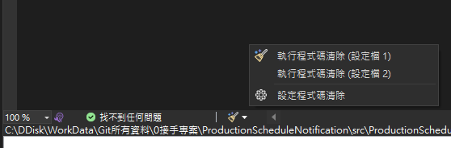
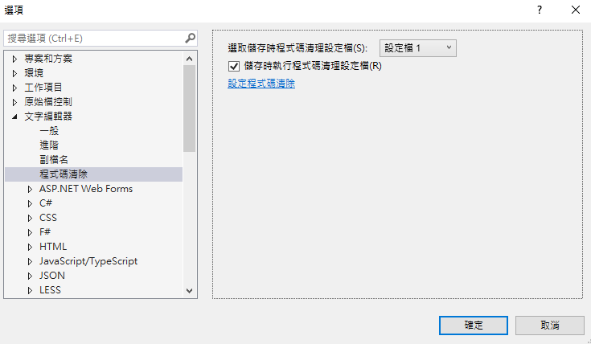

# Visual Studio 2022 存檔自動格式化檔案內容

之前在使用 Visual Studio 2019 的時候，我都會安裝 Format document on Save 的套件，讓程式碼在儲存的時候，可以順便整理程式碼的內容。

不過到了 Visual Studio 2022 的時候，就不需要再額外安裝這個套件了，且此套件的開發者也沒有再繼續維護了；在 Visual Studio 2022 的下方功能列中多了一個掃把的 icon，裡面可以執行程式碼清除的功能以及設定程式碼清除的設定，如下圖 1 所示：

圖 1、執行程式碼清除

使用掃把裡面的選項，就能夠執行程式碼清除的功能，不過每次要自己點選比較麻煩，所以還有另外一個設定要打開，在工具選項文字編輯器程式碼清除，把裡面的儲存時執行程式碼清理設定檔，如下圖 2 所示：

圖 2、儲存時執行程式碼清理設定檔

這樣當檔案有儲存的動作的時候，就會自動地幫我們進行程式碼清理的動作了。
