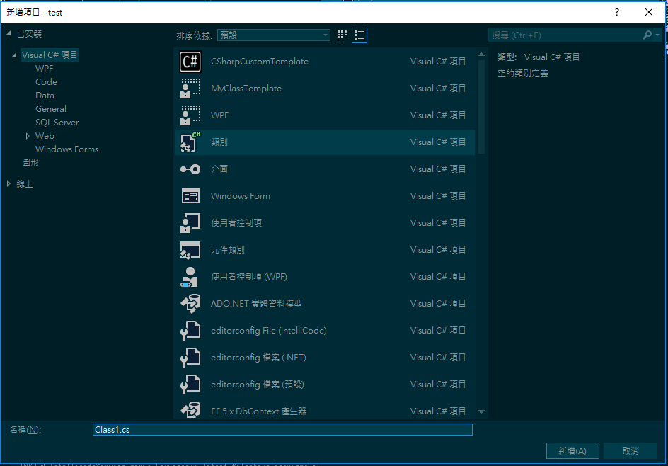
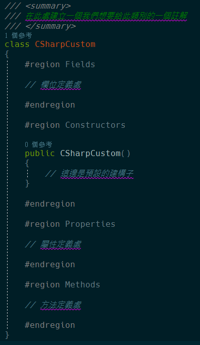
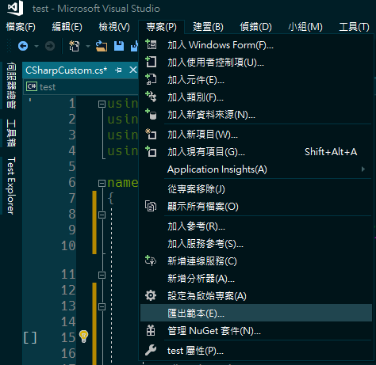
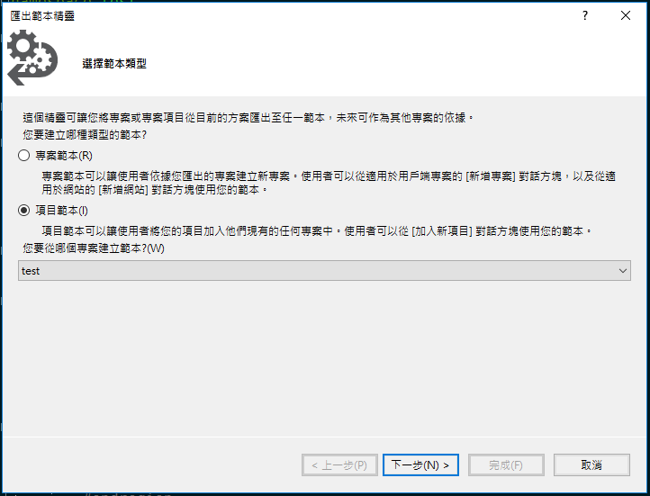
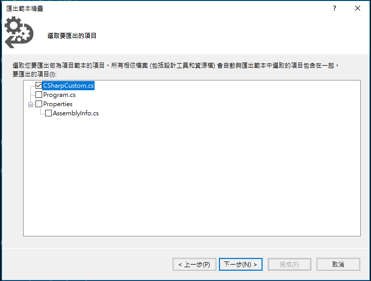
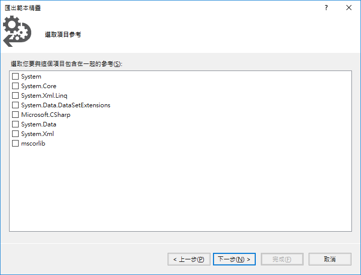
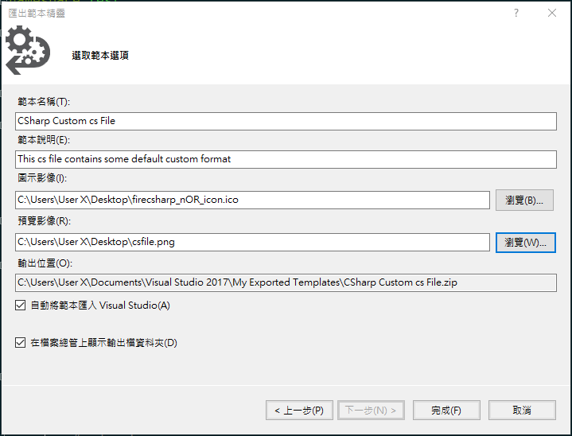
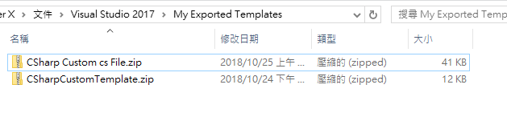
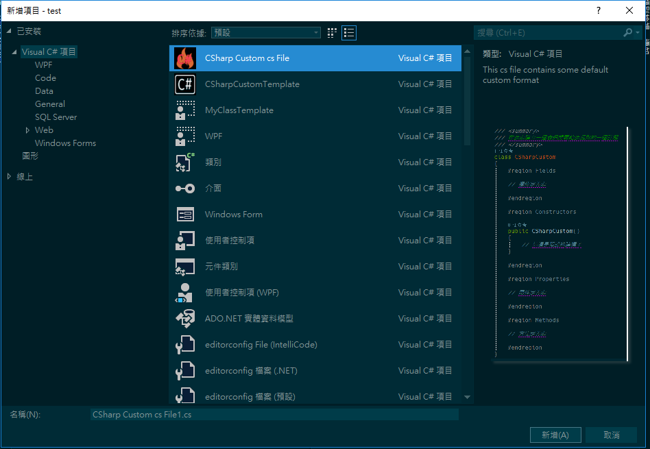

# Visual Studio Item Template 建立專屬的檔案格式

之前有介紹過如何建立專屬的專案模板，讓每次建立新專案時，都可以依據之前定義好的專案格式建立出專案樣板；這次要介紹的是如何建立自己預設的 cs 檔內容，讓每次在建立 cs 檔時，不用再花而外的時間去做一些基本的註解與定義。

首先開啟建立一個新的空白類別，之後我們就使用此 cs 檔案進行編輯，如下圖 1 所示：

圖 1、建立空白 cs 檔

建立完成之後，我們就可以在裡面定義一些預設的格式，比如說我想要在類別的上方可以有一個此類別的說明註解，並在 class 裡面定義一些程式碼撰寫的區塊分類：欄位、屬性、建構子、方法等，如下圖 2 所示：

圖 2、cs 檔內容定義

都建立好了之後，我們就將此格式匯出，點選專案 → 匯出範本，如下圖 3 所示：

圖 3、匯出範本

選擇範本輸出的類型點選項目範本，然後選擇你要輸出的檔案在哪個專案下面，如下圖 4 所示：

圖 4、選擇範本類型

選擇要輸出的 cs 檔案，一次只可選取一個檔案，如下圖 5 所示：

圖 5、選擇 cs 檔

選擇此檔案所需的項目參考，如果沒有選取的話，裡面會包含基本建立 cs 檔時所需的參考，如下圖 6 所示：

圖6、選取項目參考

之後設定一些選項，範本名稱、範本說明、範本icon、範本的圖示顯示，如下圖 7 所示：

圖 7、選取範本選項

匯出範本之後，他會顯示一個資料夾，裡面就釋放你範本的輸出，如下圖 8 所示：

圖 8、範本輸出路徑

之後，我們將 Visual studio
重新開啟，開啟後再新增類別，就可以看到我們剛剛所建立的樣式拉!

圖 9、建立自訂範本
