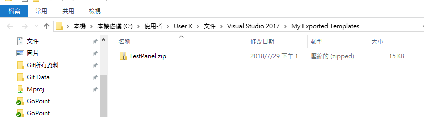
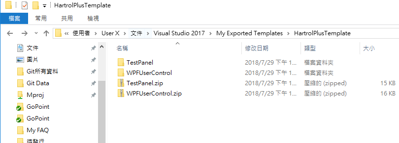
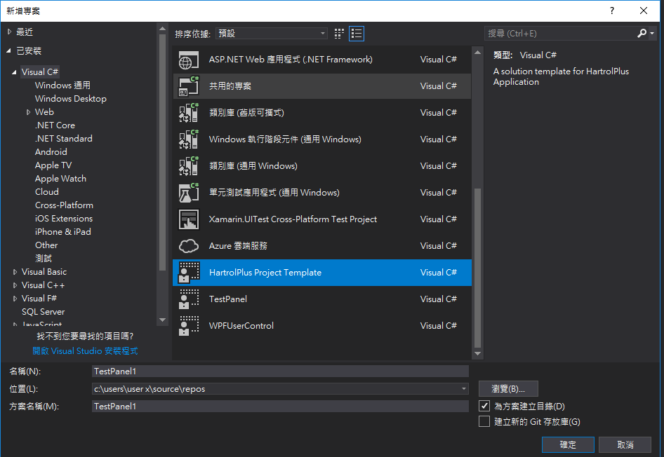

# Visual Studio Project Template建立專屬的專案模板

每次要建立新專案時，都會依照固定的流程建立專案，如果可以把這些流程通通濃縮起來是一件多麼美好的事!為此本篇的目的為建立一個統一的專案範本，當建立專案時，就可以像建立console、windows form 或是 WPF專案一樣，點兩下就建立完成專案。

首先我們建立一個起始專案，這邊以我們常用的專案建置流程作為範例，首先新建一個
Windows Form 的專案，並在同一個目錄下在建立一個 WPF 使用者控制項的專案。

WinForm 建立

WPF UserControl 建立

現在我們將我們開發的一些基本配置加上去，使用者控制項1024 * 658的尺寸，並在 WPFUserControl 專案中在建立一個 UserControl (WindowsFrom 版本的)；加入完畢之後換我們配置 TestPanel 那一個 Winform 專案，Winform 大小 1024 * 768 ，建立兩個按鈕 Start 與 Stop。

※這邊我們加入 dll 的方式有點不同，首先我們先個別在專案下建立一個 DLLImport 的資料夾，將我們平常專案中會參考到的 dll 都先加進去(像是MySql.Data.dll、ds_api_class.dll、NCLinker.dll 以及 NCLinker2)，然後再參考的地方，我們去參考裡面的 dll 檔，後面我會說明為甚麼我要這樣子操作。

基本上我們所有的東西配置完會長像下面的專案配置，這已經完成我們 Template 的第一步了！

Winform 配置

WPFUserControl 配置

配置完畢後，我們就要開始來建立我們專屬的 Template 了，在Visual Studio 中從專案找到匯出範本的選項，如果是Visual Studio 2013 的話是在檔案選項中找到匯出範本。

Visual Studio 2017匯出範本

Visual Studio 2013匯出範本

點開之後，可以看到以下畫面，
選擇要匯出的範本類型以及要從哪個專案建立範本，那我們就先選擇Winform
的專案。

範本輸出

範本名稱這邊有一點要注意，專案名稱之間不可以有空白，不然有可能會建立失敗

接下來按下下一步，可以看到以下畫面，這邊就很簡單，上面就是你的範本名稱，再來如果有想對這個範本做一些描述的話可以看的到，在來是這個範本的
icon，如果有像要新增的也可以加入一下，最後在核選方塊的地方兩個都勾選起來。

範本資料建立

完成設定之後我們可以看到跳出一個視窗，裡面放著目前我們WindowsForm
的template 壓縮檔，WindowsForm 的部分已經完成。

另一個WPF UserControl 的專案也要再做一次，如上面的步驟；完成之後我們可以看到下面兩個剛剛輸出的壓縮檔，這兩個檔案就是個別的樣板啦!目前從 Visual Studio 也可以直接看到這兩個樣板，但是本篇的目的是將這兩個專案在同一個樣板中建立出來。

接下來，我們建立一個 HartrolPlusTemplate 資料夾把這兩個壓縮檔移進去，並且將這兩個檔案解壓縮。

現在我們要合併這兩個專案成一個Template 先從隨便一個專案中複製出來一個MyTemplate.vstemplate 的檔案出來，然後看你要重新命名成什麼名字，我們就叫他HartrolPlusTemplate.vstemplate，如下圖。

我們打開 HartrolPlusTemplate.vstemplate 這個檔案編輯，第一次打開會是這樣子的內容，這個內容目前只針對其中一個範本的內容，現在我們要將它重新整理過，讓他可以包含我們上面所建立的兩個專案。

我們將檔案編輯如下，這邊有幾個重點要知道一下，

完成編輯之後，將這個檔案以及剛剛解壓縮的兩個資料夾一同選取，加入壓縮檔，且可以在命名成你要的檔名，因此我這邊就在把它命名稱
HartrolPlus Project Template.zip。

我們將此壓縮檔放置指定資料夾下

C:\\Users\\User X\\Documents\\Visual Studio
2017\\Templates\\ProjectTemplates\\Visual
C#，因為我們所開發的專案是C#所有將這個壓縮檔放到Visual C# 裡面，如果你是用其他.Net 語言開發，可以在放置對應的項語言下面。

現在完成了，可以開啟 Visual Studio，就可以看到我們所建立的樣板在裡面拉!

按下建立之後，我們就可以看到專案已建立成功了，裡面的內容什麼都有包含拉!。

**後記：**

本來我想要將 dll
加入，但是發生了底下的遺失參考的事情，等之後有機會再去將它解決吧!

本來我的想法是在 bin 的資料夾裡面建立一個 DLLImport
的資料夾，然後把所有的 dll 當放進去，再讓專案去直接參考，不用把這些 dll
另外加到專案裡面的方式，可是發生了下面的狀況，當我建立的 Template
套用之後，裡面的 dll
檔全部遺失了，在經過多方嘗試之後，目前尚未找到解決的辦法，因此目前只能使用本篇所使用的方式，加入檔案置現有專案的方式來進行，之後如果有機會在解決這個問題，目前的話，使用這個方法測試起來是沒有問題的。

