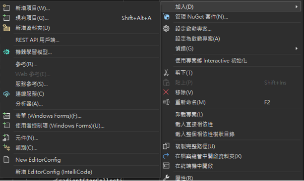
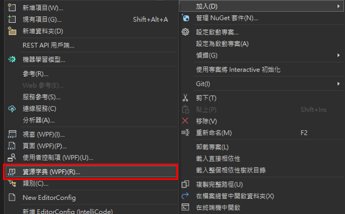
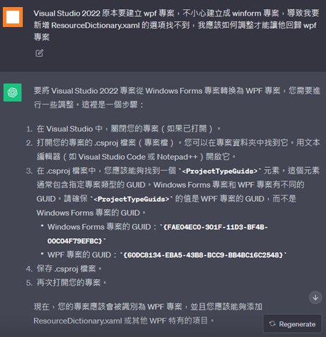
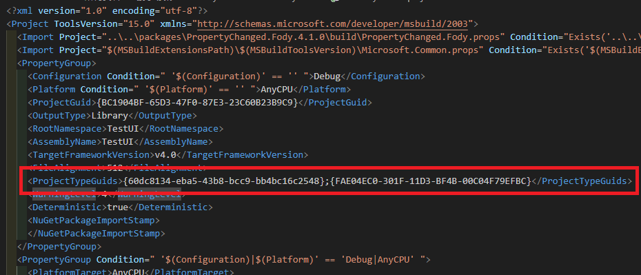

# Visual Studio WPF 專案無法加入資源字典檔案問題

最近修改到一個專案，想要點右鍵新增一個資源字典的檔案，卻發現並沒有選項可以新增，畫面如下圖 1 所示：

圖 1、沒有資源字典的選項

一般來說，應該要有資源字典選項可以選擇，如下圖 2 所示：

圖 2、有資源字典選項

從上面兩張圖中，可以很明顯的看到，怎麼連使用者控制項新增也不一樣，在圖 1 的部分，看到的是 Windows Forms；在圖 2 的部分看到的是 WPF，這很明顯就是在建立專案的時候，選錯專案範本了，並不是選到 WPF 的項目。

知道問題點之後，再來就是要將這個專案改為正確的 WPF 使用者控制項程式庫，但是找了一會並無法順利修改為 WPF 專案，只好把問題丟到 ChatGPT 上面去詢問，畫面如下圖 3 所示：

圖 3、ChatGPT 詢問

原來專案檔裡面有一個 GUID 是用來控制專案項目的，按照上面的提示，我就去找相關的專案去複製裡面的內容，然後加入到這個有問題的專案中，畫面如下圖 4 所示：

圖 4、加入正確的 GUID

加入之後，就順利改為 WPF 的專案，也能夠順利找到資源字典的選項。