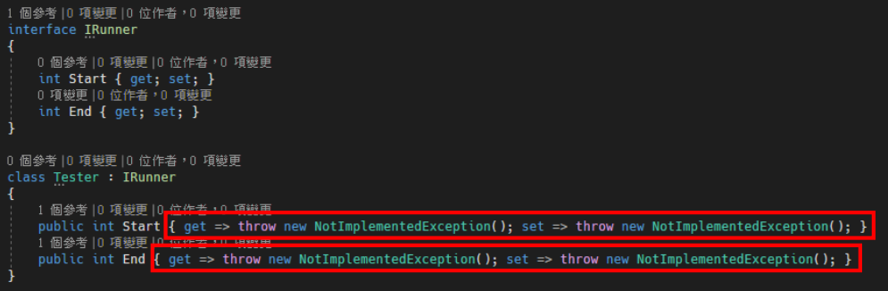
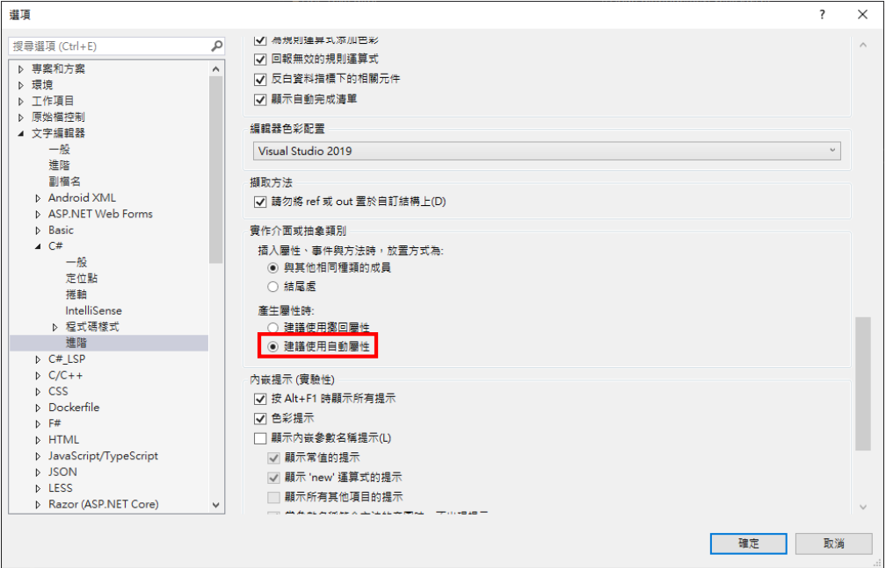

# Visual Studio 介面實作時取消建議使用擲回屬性
Visual Studio 中在實作介面的時候，通常都會使用快捷鍵幫你自動產生屬性與方法名稱，
但是，產生的同時，他也會增加一段程式碼，避免你忘記實作，程式碼如下圖 1 所示：

圖 1、自動產生程式碼

上面的 `throw new NotImplementedException()` 程式碼，是為了避免你忘記實作，就會丟
出例外；但是，如果不想要每次實作的時候都出現這段程式碼，可以從 Visual Studio 裡面進
行設定，把此功能關閉。

從上面選單中工具 → 選項 → 文字編輯器 → C# → 進階，在下面的實作介面或抽象類
別區塊裡面，找到產生屬性時的標籤，把選擇”建議使用自動屬性”，如下圖 2 所示：

圖 2、選擇建議使用自動屬性

這樣下次在實作屬性的時候就不會產生 throw new NotImplementedException() 那段程式
碼了。

### 參考資料：
1. https://stackoverflow.com/questions/43470473/implement-interface-includes-throw-newnotimplementedexception-why